> **Detail-Inventar des Bestands.** Erhoben durch vollständiges Lesen der in
> Abschnitt „Gelesene Dateien" genannten Dateien. Die IDs wurden auf die
> globalen IDs aus [01-inventar.md](../01-inventar.md) umgestellt
> (35 IDs). Zurück: [01-inventar.md](../01-inventar.md) ·
> [02-befunde.md](../02-befunde.md)

# Datenmodell-Katalog TwinCarsManager (Altbestand, Stand 2026-09-12)

Inventar für den Nuxt-Rewrite. Quelle der Wahrheit ist `src/lib/server/db/schema.ts` (2025 Zeilen) plus die 38 SQL-Migrationen `drizzle/0000…0037`. Alle Bezeichner exakt wie im Code; Spaltennamen in snake_case (DB) mit dem Drizzle-Property in Klammern, wo abweichend.

---

## 1. Überblick

| Aspekt | Befund | Fundstelle |
|---|---|---|
| Tabellen | **53** `pgTable`-Exporte in `schema.ts` (Drizzle-Snapshot 0007 kannte 34, davon 7 später gedroppt) | `schema.ts`; `drizzle/meta/0007_snapshot.json` |
| Enums | **0** `pgEnum`. Alle Diskriminatoren sind `varchar(n)` ohne CHECK. 9 TS-Union-Typen (`CustomerKind`, `CalendarEntryKind`, `WorkOrderStatus`, `WorkOrderItemKind`, `TireSeason`, `TireConstruction`, `TireStorageSeason`, `TireReminderSeason`, `PaymentMethod`) + ~25 implizite Wertemengen (siehe §2) | `schema.ts` 237, 1590ff.; `src/lib/payment-methods.ts` |
| Erweiterungen | **keine** `CREATE EXTENSION`. `gen_random_uuid()` ist seit PG 13 Core (kein pgcrypto nötig). Kein `pg_trgm`, kein GIN außer dem in 0022 wieder gedroppten `items_attributes_gin_idx` | grep über `drizzle/*.sql`, `src/` |
| ID-Strategie | `uuid('id').primaryKey().defaultRandom()` → `DEFAULT gen_random_uuid()` für 46 Tabellen. **Ausnahmen:** better-auth-Tabellen `users`, `sessions`, `accounts`, `verifications` mit `text('id').primaryKey()` (IDs erzeugt better-auth); `workshop_hours.weekday integer PK`; Composite-PKs `work_order_assignees`, `user_roles`, `role_permissions` | `schema.ts` 34, 1716ff., 1697, 1408, 1797, 1814 |
| Zeitstempel | `timestamp(..., { withTimezone: true })` = `timestamptz`, `created_at`/`updated_at` `.notNull().defaultNow()`. `updated_at` wird **nicht** per Trigger/`$onUpdate` gepflegt (0 Treffer), sondern manuell in 45 Service-/Remote-Stellen (`updatedAt: new Date()`) | grep `$onUpdate`, `updatedAt: new Date()` |
| Datum/Zeit-Typen | `date` (ISO-String) für fachliche Tage (issue_date, valid_from, birthday, stored_at …); `timestamptz` für Ereignisse (starts_at, sent_at …); Uhrzeit als `varchar(5)` `HH:MM` (`work_orders.scheduled_time`) bzw. `text` (`workshop_hours.opens_at` – DB-Typ ist jedoch `time`, siehe Drift §5) | `schema.ts` 1219, 1416; `drizzle/0011` 118 |
| Geld | durchgängig `numeric(12, 2)` (Beträge), `numeric(5, 2)` (Sätze/Prozent), `numeric(12, 3)` (Mengen), `numeric(6, 2)` (Stunden), `numeric(8, 2)` (Stundenlohn), `numeric(4, 1)` (Profil mm), `numeric(9, 6)` (Geo). Drizzle liefert `string`; Validierung mit `moneySchema` = `number()` (JS-Float, ±1e9); Rundung via `src/lib/utils/money.ts` `roundMoney`. **Keine Integer-Cents.** | `schema.ts` 58, 340, 497, 1153; `validation.ts` 187 |
| Soft-Delete | `archived boolean NOT NULL DEFAULT false` auf `customers`, `vehicles`, `suppliers`, `employees`. Belege: Storno statt Löschen (ADR-015). Alles andere Hard-Delete | `schema.ts` 219, 285, 530, 826 |
| Versionierung | 4 `*_versions`-Tabellen (`item_price_versions`, `tire_price_versions`, `employee_salary_versions`, `vehicle_license_plate_versions`): `UNIQUE(entity_id, valid_from)`, gültig = max(`valid_from <= Stichtag`), **kein** `valid_to` | ADR-007; `schema.ts` 489, 1526, 843, 307 |
| Relations | **keine** `relations()`-Definitionen (0 Treffer). Alle Joins explizit im Query-Builder | grep `relations(` |
| Raw SQL | genau 2 Stellen: `number-range-service.ts` 78 (`next_value + 1`) und `time-entry-service.ts` 338 (`CASE WHEN`) | grep ``sql` `` |
| Transaktionen | **0** `db.transaction(...)` im gesamten `src/` — pg-proxy-Testtreiber wirft bei `transaction()`; Multi-Statement-Mutationen laufen nicht atomar | grep `.transaction(`; `number-range-service.ts` 21-33 |
| Migrationslauf | `scripts/migrate.js` (drizzle-orm Migrator, `postgres` max 1) vor `node build` (Dockerfile CMD 65); dev `pnpm db:migrate`; Seeds beim ersten Request (`hooks.server.ts` 48 `seedDefaults()`) | `scripts/migrate.js`; `Dockerfile` |
| Treiber | `postgres` (postgres-js) Pool `max: 10, idle_timeout 20, connect_timeout 10`; Fallback-URL mit Klartext-Passwort im Code | `client.ts` 6-14; `drizzle.config.ts` 17-19 |

---

## 2. Enums

Kein `pgEnum`. Alle folgenden Mengen sind nur applikativ (Valibot `picklist` in den `*.remote.ts` bzw. Service-Literale) abgesichert; die DB akzeptiert jeden String bis zur `varchar`-Länge.

### 2.1 Explizite TS-Typen (`schema.ts`)

| Typ | Werte | Bedeutung | Spalte |
|---|---|---|---|
| `CustomerKind` | `regular` \| `ebay` | Regulärer Kunde (Privat/Firma) \| eBay-Käufer (nur Handle) | `customers.kind` |
| `CalendarEntryKind` | `appointment` \| `closure` | Termin \| Betriebsschließung | `calendar_entries.kind` |
| `WorkOrderStatus` | `open` \| `in_progress` \| `done` | offen \| in Bearbeitung \| abgeschlossen (Kanban) | `work_orders.status` |
| `WorkOrderItemKind` | `labor` \| `material` | Arbeitszeit \| Material | `work_order_items.kind` |
| `TireSeason` | `Sommer` \| `Winter` \| `Ganzjahres` | Reifensaison (**deutsch** gespeichert) | `tires.season` |
| `TireConstruction` | `R` \| `D` | Radial \| Diagonal | `tires.construction` |
| `TireStorageSeason` | `summer` \| `winter` \| `allseason` | Einlagerungssaison (**englisch**, Legacy) | `tire_storage.season` |
| `TireReminderSeason` | `spring` \| `autumn` | Frühjahr (Sommerräder) \| Herbst (Winterräder) | `tire_reminder_log.season` |
| `PaymentMethod` | `Überweisung` \| `Bar` \| `Lastschrift` \| `Karte` | Zahlungsart – **deutsches Label ist der gespeicherte Wert** | `documents.payment_method`, `document_payments.method`, `ledger_entries.payment_method`, `recurring_entries.payment_method` |

### 2.2 Implizite Wertemengen (varchar ohne CHECK)

| Spalte | Werte (Code-Fundstellen) | Bedeutung |
|---|---|---|
| `documents.type` | `invoice`, `offer`, `cost_estimate`, `order_confirmation` (+ `reminder`, `customer_letter` nur in ungenutztem `documentTypeSchema`) | Rechnung, Angebot, Kostenvoranschlag, Auftragsbestätigung |
| `documents.status` | `draft` (Alt-Default 0000, noch in `document-service.ts` 369/440), `created`, `sent`, `paid`, `converted` (Angebot → Rechnung), `storno` (Storno-Rechnung), `cancelled` | Belegstatus; Default seit 0006 `created` |
| `document_items.kind` | `article`, `service`, `material`, `pass_through` | Positionsart (Default `article`) |
| `items.kind` | `service`, `material`, `article`, `pass_through` (picklist `items.remote.ts`) | Katalogart (Default `article`); `tire` seit 0022 entfernt |
| `customers.salutation` | `Herr`, `Frau`, `Firma`, … (frei) | Anrede |
| `vehicle_listings.status` | `available`, `reserved`, `sold` | Bestandsstatus |
| `employee_absences.type` | `vacation`, `sick`, `other` | Urlaub, Krankheit, Sonstiges |
| `employee_absences.status` | `planned`, `approved`, `cancelled` (Default `approved`) | geplant, genehmigt, abgesagt |
| `calendar_entries.status` | `scheduled`, `completed`, `cancelled` (nur `kind='appointment'`; `closure` → NULL) | Terminstatus |
| `ledger_categories.direction`, `ledger_entries.direction`, `recurring_entries.direction` | `income`, `expense` | Einnahme, Ausgabe |
| `ledger_entries.payment_status` | `paid`, `open`, `partial` | bezahlt, offen, teilbezahlt (Default `paid`) |
| `ledger_entries.source` | `manual`, `free` (Code), Import-Quellen | Herkunft (Default `manual`) |
| `recurring_entries.interval_kind` | (kein Code außer Wipe) | Intervallart – tot |
| `reminders.status` | `open`, `sent`, `paid`, `cancelled` | Zahlungserinnerung |
| `sent_messages.status` | `sent`, `failed` | Versandstatus |
| `sent_messages.document_type` | `invoice`, `offer`, `mailing`, `tire_reminder`, `appointment_confirmation` | Mailart |
| `access_import_jobs.status` | `running`, `done`, `failed` | Importjob |
| `customer_inquiries.status` | `new`, `read`, `archived` (Kommentar 0016) | Anfragestatus (Default `new`) |
| `customer_inquiries.notification_status` | `pending`, `sent`, `failed` | interne Benachrichtigung |
| `customer_inquiries.reference_type` | `general`, `used-car`, `tire`, `article` | Kontext der Website-Anfrage |
| `ebay_credentials.environment`, `ebay_listings.environment`, `ebay_import_runs.environment` | `production`, `sandbox` | eBay-Umgebung |
| `ebay_listings.status` | `active`, `ended` | Angebot aktiv/beendet |
| `ebay_import_runs.status` | `running`, `success`, `failed` | Importlauf |
| `smtp_settings.secure` | `none`, `STARTTLS`, `TLS` | Transportsicherheit |
| `company_settings.salutation_style` | `Sie`, `Du` | Anredestil |
| `number_ranges.kind` | `invoice`, `offer`, `cost_estimate`, `order_confirmation`, `reminder`, `customer`, `tire_storage`, `work_order`, `storno` (Seed) + `tire` (nur Migration 0022) | Nummernkreis |
| `mail_templates.key` | `invoice`, `cost_estimate`, `offer`, `order_confirmation`, `reminder_1`, `tire_reminder`, `appointment_confirmation`, `mailing` | Vorlagen-Schlüssel |
| `role_permissions.permission` | `*`, `customers`, `vehicles`, `suppliers`, `employees`, `items`, `offers`, `invoices`, `orders`, `reminders`, `ledger`, `calendar`, `inventory`, `hours`, `hours:write_own`, `mailings`, `import`, `settings`, `users`, `tires`, `posts` | Modulrechte (`src/lib/permissions.ts`) |
| `accounts.provider_id` | `credential` | better-auth Provider |
| `tires.fuel_efficiency`, `wet_grip` | `A`–`E`; `noise_class` `A`–`C` | EU-Reifenlabel |
| `workshop_hours.weekday` | `0`–`6` (0 = Sonntag) | Wochentag |

---

## 3. Tabellenkatalog

Legende: Typ wie in Postgres; „Null" = nullable; FK-Regel = `ON DELETE`. Indizes und Constraints aus `schema.ts` (S) bzw. nur aus Migration (M).

### 3.1 App-Einstellungen

#### company_settings (`companySettings`)
Zweck: Singleton mit Firmendaten, Setup-Gate, Zahlungserinnerungs- und PDF-Defaults. Singleton nur applikativ (erste Zeile).

| Spalte | Typ | Null | Default | Constraint/FK | Bedeutung |
|---|---|---|---|---|---|
| id | uuid | nein | gen_random_uuid() | PK | |
| setup_completed | boolean | nein | false | | Setup-Wizard abgeschlossen |
| company_name | varchar(200) | nein | '' | | Firmenname |
| owner | varchar(200) | ja | | | Inhaber |
| street, zip(10), city(150), state(50) | varchar | nein | '' | | Anschrift, Bundesland |
| phone(30) | varchar | nein | '' | | |
| mobile(30), fax(30) | varchar | ja | | | |
| email | varchar(254) | nein | '' | | |
| website | varchar(2048) | ja | | | |
| vat_id, tax_number | varchar(30) | ja | | | USt-IdNr., Steuernummer |
| bank_name(100), iban(34), bic(11) | varchar | ja | | | |
| default_payment_term_days | integer | nein | 14 | | Zahlungsziel |
| default_currency | varchar(3) | nein | 'EUR' | | |
| default_vat_rate | numeric(5,2) | nein | '19.00' | | |
| salutation_style | varchar(10) | nein | 'Sie' | | Sie/Du |
| logo_mime | varchar(50) | ja | | | |
| logo_data | text | ja | | | **base64-Logo** (max 7 MB, `settings.remote.ts` 254) |
| pdf_footer | text | nein | '' | | |
| small_business_exempt | boolean | nein | false | | §19 UStG |
| reminder_auto_enabled | boolean | nein | true | | |
| reminder_days_1 | integer | nein | 3 | | Tage nach Fälligkeit bis 1. Erinnerung |
| reminder_recur_every_days | integer | nein | 14 (0014: 7, 0024: 14) | | Wiederholungsintervall |
| geo_lat, geo_lon | numeric(9,6) | ja | | | Karte (public API) |
| labor_item_id | uuid | ja | | FK items.id SET NULL (0033) | „Arbeitszeit"-Artikel = Stundensatz |
| created_at, updated_at | timestamptz | nein | now() | | |

Indizes: keine. Referenziert: items. Historie: 0001 (+ reminder_days_2–4, fee_1–4, interest_rate → 0024 gedroppt), 0006 (+ payroll_generation_day → 0015 gedroppt), 0014, 0018, 0033.

#### smtp_settings (`smtpSettings`)
Zweck: Singleton SMTP-Zugang.

| Spalte | Typ | Null | Default | Bedeutung |
|---|---|---|---|---|
| id | uuid | nein | gen_random_uuid() | PK |
| host | varchar(255) | nein | '' | |
| port | integer | nein | 587 | |
| secure | varchar(10) | nein | 'STARTTLS' | none/STARTTLS/TLS |
| username | varchar(200) | nein | '' | |
| password | text | nein | '' | 0000 `password_encrypted`, 0021 umbenannt zu `password` („Klartext"), **Code verschlüsselt aber wieder AES-256-GCM** (`smtp-settings-service.ts` 49; `decryptSecretIfNeeded` lässt Klartext-Altwerte durch) |
| from_address | varchar(254) | nein | '' | |
| from_name | varchar(200) | nein | '' | |
| reply_to | varchar(254) | ja | | |
| verified | boolean | nein | false | Testversand ok |
| updated_at | timestamptz | nein | now() | |

Kein `created_at`. Keine Indizes.

#### number_ranges (`numberRanges`)
Zweck: Zähler je Nummernkreis; atomare Vergabe per `UPDATE … RETURNING`.

| Spalte | Typ | Null | Default | Constraint |
|---|---|---|---|---|
| id | uuid | nein | gen_random_uuid() | PK |
| kind | varchar(30) | nein | | UNIQUE `number_ranges_kind_unique` |
| format_template | varchar(50) | nein | | z. B. `{N}`, `ZE-{YYYY}-{NNNN}` |
| next_value | integer | nein | 1 | |

Keine Zeitstempel. Seed: §6.

#### mail_templates (`mailTemplates`)
| Spalte | Typ | Null | Default | Constraint |
|---|---|---|---|---|
| id | uuid | nein | gen_random_uuid() | PK |
| key | varchar(50) | nein | | UNIQUE INDEX `mail_templates_key_idx` |
| subject | varchar(200) | nein | | |
| body | text | nein | | Platzhalter `{rechnungNummer}` … |
| is_custom | boolean | nein | false | Operator-Änderung |
| updated_at | timestamptz | nein | now() | |

### 3.2 Kunden

#### customers (`customers`)
Zweck: zentrale Parteistammdaten (Privat, Firma, eBay-Käufer).

| Spalte | Typ | Null | Default | Constraint/FK | Bedeutung |
|---|---|---|---|---|---|
| id | uuid | nein | gen_random_uuid() | PK | |
| customer_number | varchar(50) | nein | | UNIQUE INDEX `customers_customer_number_idx` | aus Range `customer` (`{N}`) |
| legacy_customer_number | varchar(50) | ja | | | Kfz-Kaufmann-Nr. (kein Unique) |
| company | varchar(200) | ja | | INDEX `customers_company_idx` | |
| salutation | varchar(30) | ja | | | |
| first_name, last_name | varchar(100) | ja | | INDEX `customers_last_name_idx` (last_name) | **beide nullable** – „Firma oder Nachname" nur applikativ |
| street | varchar(200) | ja | | | |
| zip | varchar(10) | ja | | INDEX `customers_zip_idx` | |
| city | varchar(150) | ja | | | |
| country | varchar(100) | ja | 'Deutschland' | | |
| phone, phone2, mobile, fax | varchar(30) | ja | | | |
| email | varchar(254) | ja | | | kein Unique |
| website | varchar(2048) | ja | | | |
| birthday | date | ja | | | |
| notes | text | ja | | | |
| payment_term_days | integer | ja | | | Override Zahlungsziel |
| vat_id | varchar(30) | ja | | | |
| bank_iban(34), bank_bic(11), bank_name(100) | varchar | ja | | | |
| kind | varchar(20) | nein | 'regular' | INDEX `customers_kind_idx` | regular/ebay (0011) |
| ebay_handle | varchar(100) | ja | | | nur kind=ebay |
| wants_broadcast | boolean | nein | false | INDEX `customers_wants_broadcast_idx` | Newsletter-Opt-in (0011) |
| wants_tire_reminders | boolean | nein | false | | Reifen-Erinnerung (0019) |
| archived | boolean | nein | false | | Soft-Delete |
| created_at, updated_at | timestamptz | nein | now() | | |

Rückreferenzen: `vehicles.customer_id` (SET NULL), `vehicles.previous_owner_customer_id` (SET NULL), `vehicle_sales.customer_id` (**RESTRICT**), `documents.customer_id` (SET NULL), `calendar_entries.customer_id` (SET NULL), `ledger_entries.customer_id` (SET NULL), `time_entries.customer_id` (SET NULL), `work_orders.customer_id` (SET NULL), `customer_inquiries.customer_id` (SET NULL), `tire_storage.customer_id` (**RESTRICT**), `tire_reminder_log.customer_id` (**kein FK**).
Listen-Query (`customer-service.ts`): WHERE `archived`, `kind`, ILIKE über `customer_number, company, last_name, first_name, city, zip, street, phone, mobile, email, ebay_handle`; ORDER BY `last_name`/`company`/`created_at`. Delete-Guard zählt `vehicles.customer_id`, `documents.customer_id`, `tire_storage.customer_id`.

### 3.3 Fahrzeuge

#### vehicles (`vehicles`)
Zweck: eine Tabelle für Kunden- UND Bestandsfahrzeuge; Bestand ⇔ `customer_id IS NULL`.

| Spalte | Typ | Null | Default | Constraint/FK | Bedeutung |
|---|---|---|---|---|---|
| id | uuid | nein | gen_random_uuid() | PK | |
| customer_id | uuid | ja | | FK customers SET NULL; INDEX `vehicles_customer_id_idx` | Halter |
| previous_owner_customer_id | uuid | ja | | FK customers SET NULL (0034), **kein Index** | Vorbesitzer |
| legacy_vehicle_id | varchar(50) | ja | | | |
| make | varchar(100) | ja | | | Hersteller (nullable!) |
| model | varchar(150) | ja | | | |
| vin | varchar(25) | ja | | INDEX `vehicles_vin_idx` | FIN (kein Unique) |
| first_registration | date | ja | | | EZ |
| mileage_km | integer | ja | | | |
| next_hu, next_au | date | ja | | INDEX `vehicles_next_hu_idx` | HU/AU |
| hsn(10), tsn(10) | varchar | ja | | | |
| displacement_ccm, power_kw | integer | ja | | | |
| color_code(30), engine_number(50), fuel_type(30), gearbox(30), body_type(50) | varchar | ja | | | |
| notes | text | ja | | | |
| archived | boolean | nein | false | | |
| created_at, updated_at | timestamptz | nein | now() | | |

`license_plate` wurde 0009 nach `vehicle_license_plate_versions` verschoben (Index `vehicles_license_plate_idx` gedroppt). Rückreferenzen: `vehicle_license_plate_versions`, `vehicle_purchases`, `vehicle_listings`, `vehicle_photos`, `vehicle_documents`, `vehicle_sales` (alle CASCADE), `documents.vehicle_id`, `calendar_entries.vehicle_id`, `work_orders.vehicle_id`, `tire_storage.vehicle_id` (SET NULL).
Listen-Query (`vehicle-service.ts`): WHERE `archived`, `customer_id IS NULL` (Bestand), ILIKE `make, model, vin, hsn, tsn` + Kennzeichen über Subquery `latestPlateSubquery`; leftJoin `vehicle_listings`; ORDER BY `created_at`.

#### vehicle_license_plate_versions (`vehicleLicensePlateVersions`)
Zweck: Kennzeichenhistorie (gültig = höchster `valid_from <= heute`).

| Spalte | Typ | Null | Default | Constraint/FK |
|---|---|---|---|---|
| id | uuid | nein | gen_random_uuid() | PK |
| vehicle_id | uuid | nein | | FK vehicles CASCADE; INDEX `…_vehicle_idx` |
| valid_from | date | nein | | UNIQUE INDEX `vehicle_license_plate_versions_veh_from_idx` (vehicle_id, valid_from) |
| license_plate | varchar(20) | nein | | INDEX `…_plate_idx` |
| created_at | timestamptz | nein | now() | |

Regel: kein `valid_to`; „Fahrzeug ohne Kennzeichen" nach Abmeldung nicht darstellbar; kein Exklusions-Constraint gegen dasselbe Kennzeichen zeitgleich auf zwei Fahrzeugen. Genutzt in `search-service`, `document-service`, `work-order-service`, `calendar-service` (Alias `lp`), `pickers.remote.ts`.

#### vehicle_purchases (`vehiclePurchases`)
Zweck: Ankauf-Historie (§25a UStG Bruttopreis).

| Spalte | Typ | Null | Default | FK |
|---|---|---|---|---|
| id | uuid | nein | gen_random_uuid() | PK |
| vehicle_id | uuid | nein | | FK vehicles CASCADE, **kein Index** |
| purchase_date | date | nein | | |
| purchase_price | numeric(12,2) | nein | | brutto, '0.00' bei unbekannt |
| previous_owner | varchar(200) | ja | | Snapshot-Name |
| notes | text | ja | | |
| created_at | timestamptz | nein | now() | kein updated_at |

#### vehicle_listings (`vehicleListings`)
Zweck: Verkaufsdaten eines Bestandsfahrzeugs (1:1 zu vehicles, nicht per Unique erzwungen).

| Spalte | Typ | Null | Default | Bedeutung |
|---|---|---|---|---|
| id | uuid | nein | gen_random_uuid() | PK |
| vehicle_id | uuid | nein | | FK vehicles CASCADE, **kein Index/Unique** |
| status | varchar(20) | nein | 'available' | available/reserved/sold |
| sales_price_gross | numeric(12,2) | ja | | |
| differential_tax | boolean | nein | false | §25a |
| highlights | text | ja | | |
| equipment | jsonb `string[]` | ja | '[]' | **tot** (0 Code-Referenzen) |
| location | varchar(100) | ja | | |
| internal_notes | text | ja | | **tot** |
| created_at, updated_at | timestamptz | nein | now() | |

#### vehicle_photos (`vehiclePhotos`)
Zweck: Galerie nur für Bestandsfahrzeuge (0035 löscht Fotos an Kundenfahrzeugen).

| Spalte | Typ | Null | Default |
|---|---|---|---|
| id | uuid | nein | gen_random_uuid() |
| vehicle_id | uuid | nein | FK vehicles CASCADE, **kein Index** |
| mime | varchar(50) | nein | |
| data_url | text | nein | **base64 Data-URL**, max 28 MB Stringlänge (`vehicles.remote.ts` 604) |
| is_main | boolean | nein | false |
| sort_order | integer | nein | 0 |
| created_at | timestamptz | nein | now() |

#### vehicle_documents (`vehicleDocuments`)
Zweck: Dateianhänge (Brief, Vertrag, HU-Bericht) als `bytea`.

| Spalte | Typ | Null | Default | FK |
|---|---|---|---|---|
| id | uuid | nein | gen_random_uuid() | PK |
| vehicle_id | uuid | nein | | FK vehicles CASCADE; INDEX `vehicle_documents_vehicle_id_idx` |
| file_name | varchar(255) | nein | | |
| mime | varchar(100) | nein | | pdf/jpeg/png/webp (Service) |
| size_bytes | integer | nein | | |
| data | bytea | nein | | max 15 MiB (`MAX_VEHICLE_DOCUMENT_BYTES`) |
| note | varchar(500) | ja | | |
| uploaded_at | timestamptz | nein | now() | |

Listen lesen nur Meta-Spalten (`vehicle-document-service.ts`).

#### vehicle_sales (`vehicleSales`)
Zweck: Verkaufs-Historie; geschrieben beim Bezahlen einer Bestandsverkaufs-Rechnung.

| Spalte | Typ | Null | Default | FK |
|---|---|---|---|---|
| id | uuid | nein | gen_random_uuid() | PK |
| vehicle_id | uuid | nein | | FK vehicles CASCADE, kein Index |
| customer_id | uuid | nein | | FK customers **RESTRICT**, kein Index |
| invoice_id | uuid | ja | | **kein FK** (Backlink documents) |
| sale_date | date | nein | | |
| sales_price_gross | numeric(12,2) | nein | | |
| trade_in_value | numeric(12,2) | ja | | **tot** (0 Referenzen) |
| notes | text | ja | | |
| created_at | timestamptz | nein | now() | |

### 3.4 Artikel / Leistungen / Lieferanten

#### items (`items`)
Zweck: Katalog für Leistungen/Material (Reifen seit 0022 in `tires`).

| Spalte | Typ | Null | Default | Constraint |
|---|---|---|---|---|
| id | uuid | nein | gen_random_uuid() | PK |
| legacy_item_number | varchar(50) | ja | | |
| article_number | varchar(50) | nein | | UNIQUE INDEX `items_article_number_idx` (`ARBEIT` = Seed) |
| description | text | nein | | |
| kind | varchar(20) | nein | 'article' | INDEX `items_kind_idx`; service/material/article/pass_through |
| unit | varchar(20) | ja | | z. B. `Std.` |
| purchase_price_net | numeric(12,2) | ja | | |
| stock_on_hand | integer | nein | 0 | |
| online_bookable | boolean | nein | false | Terminbuchung public API (0028) |
| notes | text | ja | | |
| created_at, updated_at | timestamptz | nein | now() | |

Gedroppt: `unit_price_net` (0008 → Versionen), `stock_min/stock_max/discontinued` (0026), `attributes/online_sellable/shipping_option_id` (0022). Rückreferenzen: `item_price_versions` (CASCADE), `document_items.item_id`, `work_order_items.item_id`, `company_settings.labor_item_id` (SET NULL).
Listen-Query: WHERE `kind`, ILIKE `article_number, description`; ORDER BY `created_at`.

#### item_price_versions (`itemPriceVersions`)
| Spalte | Typ | Null | Default | Constraint |
|---|---|---|---|---|
| id | uuid | nein | gen_random_uuid() | PK |
| item_id | uuid | nein | | FK items CASCADE; INDEX `item_price_versions_item_idx` |
| valid_from | date | nein | | UNIQUE INDEX `item_price_versions_item_from_idx` (item_id, valid_from) |
| unit_price_net | numeric(12,2) | nein | | |
| created_at | timestamptz | nein | now() | |

#### suppliers (`suppliers`)
| Spalte | Typ | Null | Default |
|---|---|---|---|
| id | uuid | nein | gen_random_uuid() |
| legacy_supplier_number | varchar(50) | ja | |
| name | varchar(200) | nein | kein Unique |
| customer_number_at_supplier | varchar(50) | ja | |
| contact_person | varchar(100) | ja | |
| street(200), zip(10), city(150), country(100) | varchar | ja | |
| phone(30), fax(30) | varchar | ja | |
| email | varchar(254) | ja | |
| website | varchar(2048) | ja | |
| bank_name(100), iban(34), bic(11) | varchar | ja | |
| notes | text | ja | |
| archived | boolean | nein | false |
| created_at, updated_at | timestamptz | nein | now() |

**Keine Indizes.** Listen-Query: ILIKE `name, contact_person, city, phone, email`; WHERE `archived`; ORDER BY `name`/`created_at`. Rückreferenzen: `ledger_entries.supplier_id`, `recurring_entries.supplier_id` (SET NULL).

### 3.5 Belege

#### documents (`documents`)
Zweck: gemeinsames Belegmodell (Rechnung, Angebot, KVA, Auftragsbestätigung, Storno).

| Spalte | Typ | Null | Default | Constraint/FK | Bedeutung |
|---|---|---|---|---|---|
| id | uuid | nein | gen_random_uuid() | PK | |
| document_number | varchar(50) | nein | | UNIQUE INDEX `documents_document_number_idx` | Nummernkreis je type; Storno `S-{N}` |
| legacy_document_number | varchar(50) | ja | | | |
| type | varchar(30) | nein | | INDEX `documents_type_status_idx` (type, status) | |
| status | varchar(30) | nein | 'created' (0000: 'draft') | | |
| customer_id | uuid | ja | | FK customers SET NULL; INDEX `documents_customer_id_idx` | |
| vehicle_id | uuid | ja | | FK vehicles SET NULL, **kein Index** | |
| issue_date | date | nein | | INDEX `documents_issue_date_idx` | |
| service_date | date | ja | | | Leistungsdatum |
| due_date | date | ja | | | Fälligkeit (nullable auch bei Rechnung) |
| payment_method | varchar(30) | ja | | | deutsches Label |
| tax_rate | numeric(5,2) | nein | '19.00' | | |
| net_total, tax_total, gross_total, discount_total | numeric(12,2) | nein | '0' | | Summen (Snapshot) |
| header, footer, notes | text | ja | | | |
| converted_to_invoice_id | uuid | ja | | **kein FK**; INDEX `documents_converted_to_invoice_idx` (0001) | Angebot → Rechnung |
| reminder_level | integer | nein | 0 | | Anzahl gesendeter Erinnerungen |
| cancelled_at | timestamptz | ja | | | (0020) |
| cancellation_reason | varchar(500) | ja | | | |
| cancelled_by_document_id | uuid | ja | | FK documents SET NULL **nur per SQL** (`documents_cancelled_by_fk`); INDEX `documents_cancelled_by_idx` | Original → Storno |
| cancels_document_id | uuid | ja | | FK documents SET NULL **nur per SQL** (`documents_cancels_fk`); INDEX `documents_cancels_idx` | Storno → Original |
| work_order_id | uuid | ja | | FK work_orders SET NULL **nur per SQL** (`documents_work_order_id_work_orders_id_fk`, 0037); INDEX `documents_work_order_id_idx` | dauerhafter Auftrag-Backlink |
| created_at, updated_at | timestamptz | nein | now() | | |

Rückreferenzen: `document_items`, `document_payments`, `document_pdfs`, `reminders.invoice_id` (alle CASCADE), `ledger_entries.document_id`, `sent_messages.document_id`, `time_entries.document_id`, `work_orders.invoice_id` (SET NULL), Self-FKs, `vehicle_sales.invoice_id` (kein FK).
Listen-Query (`document-service.ts`): WHERE `type`, `status`, `customer_id`, `vehicle_id`, ILIKE `document_number` + leftJoin customers ILIKE `last_name, company`; leftJoin `lp` (Kennzeichen), `pt` (Zahlungssumme-Subquery); ORDER BY `issue_date`/`created_at` DESC. DATEV/Sales-Ledger: WHERE `type='invoice'`, `status`, `issue_date` BETWEEN.

#### document_items (`documentItems`)
Zweck: Belegpositionen mit Preis-Snapshot (ADR-007).

| Spalte | Typ | Null | Default | FK |
|---|---|---|---|---|
| id | uuid | nein | gen_random_uuid() | PK |
| document_id | uuid | nein | | FK documents CASCADE, **kein Index** |
| position_number | integer | nein | | ORDER BY |
| kind | varchar(20) | nein | 'article' | |
| item_id | uuid | ja | | FK items SET NULL, kein Index |
| tire_id | uuid | ja | | FK tires SET NULL (`document_items_tire_id_fk`, 0022); INDEX `document_items_tire_idx` **nur in Migration** |
| article_number | varchar(50) | ja | | Snapshot |
| description | text | nein | | |
| quantity | numeric(12,3) | nein | '1' | |
| unit | varchar(20) | ja | | |
| unit_price_net | numeric(12,2) | nein | '0' | Snapshot |
| discount_percent | numeric(5,2) | nein | '0' | |
| tax_rate | numeric(5,2) | nein | '19.00' | |
| line_total_net, line_total_gross | numeric(12,2) | nein | '0' | |

**Keine Zeitstempel.** `schema.ts` definiert für diese Tabelle **kein** Index-Array.

#### document_payments (`documentPayments`)
| Spalte | Typ | Null | Default | FK |
|---|---|---|---|---|
| id | uuid | nein | gen_random_uuid() | PK |
| document_id | uuid | nein | | FK documents CASCADE, **kein Index** |
| payment_date | date | nein | | |
| amount | numeric(12,2) | nein | | |
| method | varchar(30) | ja | | |
| notes | text | ja | | |
| created_at | timestamptz | nein | now() | |

#### document_pdfs (`documentPdfs`)
Zweck: PDF-Cache (ADR-006), 1:1 zu documents.

| Spalte | Typ | Null | Default | Constraint |
|---|---|---|---|---|
| id | uuid | nein | gen_random_uuid() | PK |
| document_id | uuid | nein | | FK documents CASCADE; UNIQUE INDEX `document_pdfs_document_id_idx` |
| input_hash | varchar(64) | nein | | SHA-256 über Render-Input |
| filename | varchar(200) | nein | | |
| mime | varchar(50) | nein | 'application/pdf' | |
| size | integer | nein | | |
| data | bytea | nein | | |
| created_at | timestamptz | nein | now() | |

#### reminders (`reminders`)
Zweck: Zahlungserinnerung (eigener Nummernkreis, nicht in documents).

| Spalte | Typ | Null | Default | Constraint |
|---|---|---|---|---|
| id | uuid | nein | gen_random_uuid() | PK |
| document_number | varchar(50) | nein | | UNIQUE `reminders_document_number_unique` (`ZE-{YYYY}-{NNNN}`) |
| invoice_id | uuid | nein | | FK documents CASCADE; INDEX `reminders_invoice_id_idx` |
| level | integer | nein | | UNIQUE INDEX `reminders_invoice_level_idx` (invoice_id, level) |
| issue_date | date | nein | | |
| due_date | date | nein | | |
| status | varchar(20) | nein | 'open' | INDEX `reminders_status_idx` |
| notes | text | ja | | |
| created_at, updated_at | timestamptz | nein | now() | |

Gedroppt 0024: `fee`, `interest`. Rückreferenz: `reminder_pdfs`. Query (`reminder-service.ts`): innerJoin documents WHERE `type='invoice'`, `status`, `due_date <`, leftJoin Subquery `lastReminders` (max issue_date je invoice).

#### reminder_pdfs (`reminderPdfs`)
Spiegel von `document_pdfs` mit `reminder_id uuid NOT NULL FK reminders CASCADE`, UNIQUE INDEX `reminder_pdfs_reminder_id_idx`; übrige Spalten identisch (input_hash, filename, mime, size, data bytea, created_at).

### 3.6 Mitarbeiter und Zeit

#### employees (`employees`)
| Spalte | Typ | Null | Default | Bedeutung |
|---|---|---|---|---|
| id | uuid | nein | gen_random_uuid() | PK |
| personnel_number | varchar(30) | nein | | **kein Unique** (Validierung erlaubt 20 Zeichen) |
| salutation(30), title(30) | varchar | ja | | |
| first_name, last_name | varchar(100) | nein | | |
| birthday | date | ja | | |
| birthplace(100), nationality(50) | varchar | ja | | |
| street(200), zip(10), city(150) | varchar | ja | | |
| country | varchar(100) | ja | 'Deutschland' | |
| private_email | varchar(254) | ja | | |
| private_phone, mobile | varchar(30) | ja | | |
| hire_date, termination_date | date | ja | | |
| position(150), department(100), employment_type(30) | varchar | ja | | |
| weekly_hours | numeric(5,2) | ja | | |
| vacation_days_per_year | integer | ja | | |
| tax_id(30), tax_class(5), social_insurance_number(30), health_insurance(100) | varchar | ja | | |
| bank_account_holder(200), bank_iban(34), bank_bic(11), bank_name(100) | varchar | ja | | |
| archived | boolean | nein | false | |
| created_at, updated_at | timestamptz | nein | now() | |

Gedroppt 0008: `monthly_salary`, `hourly_wage`. **Keine Indizes.** Listen-Query: ILIKE `personnel_number, first_name, last_name, position, department, private_email, private_phone, mobile`; WHERE `archived`; ORDER BY `last_name`/`created_at`. Rückreferenzen: `employee_salary_versions`, `employee_absences`, `time_entries.employee_id`, `work_order_assignees` (CASCADE), `calendar_entries.employee_id`, `work_order_items.employee_id` (SET NULL).

#### employee_salary_versions (`employeeSalaryVersions`)
| Spalte | Typ | Null | Constraint |
|---|---|---|---|
| id | uuid | nein | PK |
| employee_id | uuid | nein | FK employees CASCADE; INDEX `employee_salary_versions_employee_idx` |
| valid_from | date | nein | UNIQUE INDEX `employee_salary_versions_emp_from_idx` (employee_id, valid_from) |
| monthly_salary | numeric(12,2) | ja | |
| hourly_wage | numeric(8,2) | ja | |
| created_at | timestamptz | nein | now() |

#### employee_absences (`employeeAbsences`)
| Spalte | Typ | Null | Default | Constraint |
|---|---|---|---|---|
| id | uuid | nein | gen_random_uuid() | PK |
| employee_id | uuid | nein | | FK employees CASCADE; INDEX `employee_absences_employee_id_idx` |
| type | varchar(20) | nein | | vacation/sick/other |
| date_from | date | nein | | INDEX `employee_absences_date_from_idx` |
| date_to | date | nein | | |
| half_day | boolean | nein | false | |
| notes | text | ja | | |
| status | varchar(20) | nein | 'approved' | |
| attachment_mime | varchar(50) | ja | | (0003) |
| attachment_name | varchar(200) | ja | | |
| attachment_data | text | ja | | **base64**, max 7 MB Stringlänge; Listen laden per `select()` alle Spalten (`absence-service.ts` 107ff.) |
| created_at, updated_at | timestamptz | nein | now() | |

Query: WHERE `employee_id`, Überlappung `date_from <= … AND date_to >= …`, `type`, `status`.

#### time_entries (`timeEntries`)
Zweck: Stundenerfassung (Aufwand, kein Stempeln).

| Spalte | Typ | Null | Default | Constraint/FK |
|---|---|---|---|---|
| id | uuid | nein | gen_random_uuid() | PK |
| employee_id | uuid | nein | | FK employees CASCADE (`time_entries_employee_id_fk`); INDEX |
| date | date | nein | | INDEX `time_entries_date_idx` |
| hours | numeric(6,2) | nein | | |
| document_id | uuid | ja | | FK documents SET NULL; INDEX |
| customer_id | uuid | ja | | FK customers SET NULL; INDEX |
| task | varchar(200) | ja | | |
| note | text | ja | | |
| work_order_id | uuid | ja | | FK work_orders SET NULL; INDEX `time_entries_work_order_id_idx` (0033) |
| work_order_item_id | uuid | ja | | FK work_order_items **CASCADE**; UNIQUE INDEX partial `time_entries_work_order_item_id_idx` WHERE NOT NULL (in DO-Block → **nicht in pg-mem**) |
| created_at, updated_at | timestamptz | nein | now() | |

Query: WHERE `employee_id`, `date` BETWEEN, `document_id`, `customer_id`, `work_order_id`; leftJoin employees/documents/customers/work_orders; ORDER BY `date`, `created_at`. Raw `CASE WHEN document_id IS NOT NULL` für abrechenbare Stunden.

### 3.7 Aufträge

#### work_orders (`workOrders`)
| Spalte | Typ | Null | Default | Constraint/FK |
|---|---|---|---|---|
| id | uuid | nein | gen_random_uuid() | PK |
| order_number | varchar(50) | nein | | UNIQUE `work_orders_order_number_unique` (`AU-{YYYY}-{NNNN}`) |
| title | varchar(200) | nein | | |
| description | text | ja | | |
| status | varchar(20) | nein | 'open' | INDEX `work_orders_status_idx` |
| customer_id | uuid | ja | | FK customers SET NULL; INDEX `work_orders_customer_id_idx` |
| vehicle_id | uuid | ja | | FK vehicles SET NULL, **kein Index** |
| appointment_id | uuid | ja | | FK calendar_entries SET NULL; UNIQUE INDEX partial `work_orders_appointment_id_idx` WHERE NOT NULL (DO-Block) |
| invoice_id | uuid | ja | | FK documents SET NULL; INDEX `work_orders_invoice_id_idx` — nur AKTIVE Rechnung |
| scheduled_date | date | ja | | (0034, aus `scheduled_at` konvertiert) |
| scheduled_time | varchar(5) | ja | | `HH:MM` |
| completed_at | timestamptz | ja | | |
| created_at, updated_at | timestamptz | nein | now() | |

Regel: mind. Kunde ODER Fahrzeug (nur applikativ); nach Rechnung GoBD-gesperrt. Query: WHERE `status`, `customer_id`, `vehicle_id`, ILIKE `order_number, title` + customers; leftJoin customers/vehicles/lp/documents/calendar_entries; ORDER BY `created_at`. Kalender: WHERE `scheduled_date` BETWEEN.

#### work_order_assignees (`workOrderAssignees`)
`work_order_id uuid FK work_orders CASCADE`, `employee_id uuid FK employees CASCADE`; PK (`work_order_id`, `employee_id`) `work_order_assignees_work_order_id_employee_id_pk`. Kein Index auf `employee_id` allein (Kalender filtert danach).

#### work_order_items (`workOrderItems`)
| Spalte | Typ | Null | Default | FK |
|---|---|---|---|---|
| id | uuid | nein | gen_random_uuid() | PK |
| work_order_id | uuid | nein | | FK work_orders CASCADE; INDEX `work_order_items_work_order_id_idx` |
| position | integer | nein | | |
| kind | varchar(20) | nein | 'labor' | labor/material |
| item_id | uuid | ja | | FK items SET NULL, kein Index |
| description | text | nein | | |
| quantity | numeric(12,3) | nein | '1' | |
| unit | varchar(20) | ja | | |
| unit_price_net | numeric(12,2) | nein | | Snapshot |
| employee_id | uuid | ja | | FK employees SET NULL, kein Index |
| hours | numeric(6,2) | ja | | labor |
| done_at | date | nein | | |
| created_at, updated_at | timestamptz | nein | now() | |

Rückreferenz: `time_entries.work_order_item_id` (CASCADE, 1:1 write-through).

### 3.8 Reifen

#### tires (`tires`)
| Spalte | Typ | Null | Default | Constraint |
|---|---|---|---|---|
| id | uuid | nein | gen_random_uuid() | PK |
| article_number | varchar(50) | nein | | UNIQUE INDEX `tires_article_number_idx` (Range `tire` `{N}`) |
| legacy_article_number | varchar(50) | ja | | |
| brand | varchar(80) | nein | | INDEX `tires_brand_idx` |
| model | varchar(120) | nein | | |
| width, aspect_ratio, diameter_inch | integer | nein | | INDEX `tires_size_idx` (width, aspect_ratio, diameter_inch) |
| construction | varchar(5) | nein | 'R' | |
| load_index | varchar(10) | ja | | |
| speed_index | varchar(5) | ja | | |
| season | varchar(20) | nein | | INDEX `tires_season_idx` |
| ean | varchar(20) | ja | | kein Unique |
| manufacturer_part_number | varchar(50) | ja | | |
| fuel_efficiency, wet_grip, noise_class | varchar(1) | ja | | EU-Label |
| noise_db | integer | ja | | |
| run_flat, reinforced, studded_winter, m_s_marking, snow_flake, ev_certified | boolean | nein | false | |
| description | text | ja | | |
| purchase_price_net | numeric(12,2) | ja | | |
| stock_on_hand | integer | nein | 0 | |
| online_sellable | boolean | nein | false | INDEX `tires_online_sellable_idx` |
| notes | text | ja | | |
| created_at, updated_at | timestamptz | nein | now() | |

Gedroppt: `stock_min/stock_max/discontinued` (0026), `shipping_option_id` (0032). Query: WHERE `season`, `online_sellable`, `width/aspect_ratio/diameter_inch`, `construction`, ILIKE `article_number, brand, model, ean`; ORDER BY `brand`, `created_at`. Rückreferenzen: `tire_price_versions`, `tire_photos` (CASCADE), `document_items.tire_id`, `ebay_listings.tire_id` (SET NULL).

#### tire_price_versions (`tirePriceVersions`)
`tire_id uuid FK tires CASCADE` (`tire_price_versions_tire_id_fk`), `valid_from date`, `unit_price_net numeric(12,2)`, `created_at`; UNIQUE INDEX `tire_price_versions_tire_from_idx` (tire_id, valid_from). Kein separater Index auf `tire_id` (Unique deckt ab).

#### tire_photos (`tirePhotos`)
`tire_id uuid FK tires CASCADE` (INDEX `tire_photos_tire_idx`), `mime varchar(50)`, `data text` (**base64**, max 8 MiB), `sort_order integer 0`, `is_main boolean false`, `created_at`.

#### tire_storage (`tireStorage`)
Zweck: Kundenreifen im Lager; QR-Label mit `storage_number`.

| Spalte | Typ | Null | Default | Constraint/FK |
|---|---|---|---|---|
| id | uuid | nein | gen_random_uuid() | PK |
| storage_number | varchar(50) | nein | | UNIQUE INDEX `tire_storage_storage_number_idx` (`L-{YYYY}-{NNNN}`) |
| customer_id | uuid | nein | | FK customers **RESTRICT** (`tire_storage_customer_id_fk`); INDEX |
| vehicle_id | uuid | ja | | FK vehicles SET NULL, kein Index |
| brand(80), model(120), size(40) | varchar | ja | | |
| profile_mm | numeric(4,1) | ja | | |
| dot_year | integer | ja | | |
| season | varchar(20) | ja | | summer/winter/allseason |
| quantity | integer | nein | 4 | |
| photos | jsonb `{mime,data,caption?}[]` | nein | '[]' | **base64 inline**; Listen-Select wählt explizit ohne photos |
| notes | text | ja | | |
| stored_at | date | nein | (Migration: `DEFAULT now()`, Schema: keiner) | |
| retrieved_at | date | ja | | INDEX `tire_storage_active_idx`; NULL = eingelagert |
| created_at, updated_at | timestamptz | nein | now() | |

#### tire_reminder_log (`tireReminderLog`)
`customer_id uuid NOT NULL` (**kein FK**), `season varchar(20)`, `year integer`, `sent_at timestamptz now()`. UNIQUE (`customer_id`, `season`, `year`) — in Migration als CONSTRAINT `tire_reminder_log_unique`, in schema.ts als `uniqueIndex`. Indizes `…_customer_id_idx`, `…_season_year_idx`.

### 3.9 Kalender

#### calendar_entries (`calendarEntries`)
Zweck: Termine und Betriebsschließungen, diskriminiert per `kind` (ADR-011).

| Spalte | Typ | Null | Default | FK |
|---|---|---|---|---|
| id | uuid | nein | gen_random_uuid() | PK |
| kind | varchar(20) | nein | | INDEX `calendar_entries_kind_idx` |
| title | varchar(200) | nein | | |
| starts_at, ends_at | timestamptz | nein | | INDEX `calendar_entries_starts_at_idx` |
| all_day | boolean | nein | false | |
| status | varchar(20) | ja | | nur appointment |
| customer_id, vehicle_id, employee_id | uuid | ja | | FK SET NULL je, **keine Indizes** |
| notes | text | ja | | Bestätigungscode der Online-Buchung landet hier |
| created_at | timestamptz | nein | now() | **kein updated_at** |

Query: WHERE `kind`, `starts_at`/`ends_at` Bereich, `employee_id`, `customer_id`, `vehicle_id`, `status`; leftJoin customers/vehicles/employees/lp. Rückreferenz: `work_orders.appointment_id`.

#### public_holidays (`publicHolidays`)
`state varchar(50)`, `date date`, `name varchar(100)`; keine Indizes, keine Zeitstempel. **Tot** – 0 Referenzen außerhalb schema.ts; Feiertage werden in `holiday-service.ts` berechnet.

### 3.10 Buchhaltung

#### ledger_categories (`ledgerCategories`)
`direction varchar(10)`, `name varchar(100)` UNIQUE `ledger_categories_name_unique`, `default_tax_rate numeric(5,2)` nullable. Keine Zeitstempel. Seed §6.

#### ledger_entries (`ledgerEntries`)
| Spalte | Typ | Null | Default | FK |
|---|---|---|---|---|
| id | uuid | nein | gen_random_uuid() | PK |
| entry_number | varchar(50) | ja | | kein Unique, kein Nummernkreis |
| direction | varchar(10) | nein | | INDEX `ledger_entries_direction_idx` |
| entry_date | date | nein | | INDEX `ledger_entries_entry_date_idx` |
| amount_gross, amount_net | numeric(12,2) | nein | | |
| tax_amount | numeric(12,2) | nein | '0' | |
| tax_rate | numeric(5,2) | nein | '19.00' | |
| category_id | uuid | ja | | FK ledger_categories SET NULL; INDEX |
| description | text | nein | | |
| payment_method | varchar(30) | ja | | |
| payment_status | varchar(20) | nein | 'paid' | |
| supplier_id | uuid | ja | | FK suppliers SET NULL, kein Index |
| customer_id | uuid | ja | | FK customers SET NULL, kein Index |
| document_id | uuid | ja | | FK documents SET NULL, kein Index |
| source | varchar(30) | nein | 'manual' | |
| recurring_template_id | uuid | ja | | **kein FK, tot** |
| created_at | timestamptz | nein | now() | kein updated_at |

Query: WHERE `direction`, `entry_date` BETWEEN, ILIKE `entry_number, description`; ORDER BY `entry_date`, `created_at`.

#### recurring_entries (`recurringEntries`)
`name varchar(200)`, `direction varchar(10)`, `category_id FK ledger_categories SET NULL`, `supplier_id FK suppliers SET NULL`, `amount_gross numeric(12,2)`, `tax_rate numeric(5,2) '19.00'`, `payment_method varchar(30)`, `interval_kind varchar(20)`, `interval_every integer 1`, `start_date date`, `end_date date`, `occurrences_limit integer`, `occurrences_created integer 0`, `next_run_date date`, `paused boolean false`, `notes text`, `created_at`. Keine Indizes. **Tot** – einzige Referenz ist `wipeData()` in `import-service.ts` 386; kein Service, keine Route.

### 3.11 Versand, Import, Web, Integration

#### sent_messages (`sentMessages`)
| Spalte | Typ | Null | Default |
|---|---|---|---|
| id | uuid | nein | gen_random_uuid() |
| document_id | uuid | ja | FK documents SET NULL; INDEX `sent_messages_document_id_idx` (Zahlungserinnerungen verweisen auf die Rechnung, Mailings auf NULL) |
| document_type | varchar(30) | nein | |
| recipient_email | varchar(254) | nein | |
| recipient_name | varchar(200) | ja | |
| subject | varchar(200) | nein | |
| body_text | text | nein | |
| attachment_meta | jsonb `{name,size}[]` | ja | '[]' |
| sent_at | timestamptz | nein | now(); INDEX `sent_messages_sent_at_idx` |
| status | varchar(20) | nein | 'sent' |
| error_message | text | ja | |
| smtp_message_id | varchar(200) | ja | |

#### access_import_jobs (`accessImportJobs`)
`started_at timestamptz now()`, `finished_at`, `status varchar(20) 'running'`, `progress integer 0` (0031), `progress_label varchar(200)`, `tables_processed`, `rows_imported`, `rows_skipped` integer 0, `notes text`. Kein Index (ORDER BY `started_at DESC LIMIT 1`).

#### customer_inquiries (`customerInquiries`)
| Spalte | Typ | Null | Default |
|---|---|---|---|
| id | uuid | nein | gen_random_uuid() |
| customer_id | uuid | ja | FK customers SET NULL (`customer_inquiries_customer_id_fk`), kein Index |
| customer_email | varchar(254) | nein | |
| customer_name | varchar(200) | nein | |
| customer_phone | varchar(30) | ja | |
| subject | varchar(200) | nein | |
| message | text | nein | |
| reference_id | varchar(64) | ja | |
| reference_type | varchar(20) | ja | |
| status | varchar(20) | nein | 'new'; INDEX |
| notification_status | varchar(20) | nein | 'pending'; INDEX (0023) |
| notification_sent_at | timestamptz | ja | |
| notification_error | text | ja | |
| created_at | timestamptz | nein | now(); INDEX |

#### posts (`posts`)
`title varchar(200)`, `slug varchar(220)` UNIQUE INDEX `posts_slug_idx`, `excerpt varchar(500)`, `body text`, `cover_image jsonb {mime,data}` (**base64**, max 7 MB; Listen laden per `select()` inkl. cover_image, `post-service.ts` 82), `published boolean false`, `published_at timestamptz`, `created_at`, `updated_at`; INDEX `posts_published_idx` (published, published_at). Query: ILIKE `title, excerpt`; WHERE `published`; ORDER BY `published_at`/`created_at`.

#### ebay_credentials (`ebayCredentials`)
`ebay_username varchar(100)`, `access_token text` (AES-GCM), `access_token_expires_at`, `refresh_token text NOT NULL` (AES-GCM), `refresh_token_expires_at`, `scopes text ''`, `environment varchar(20) 'production'`, `connected_at`, `updated_at`. Singleton nur applikativ.

#### ebay_listings (`ebayListings`)
`ebay_item_id varchar(30)`, `sku varchar(80)`, `title varchar(255)`, `price_value numeric(12,2)`, `price_currency varchar(3)`, `quantity_available`, `quantity_sold` integer, `listing_type varchar(30)`, `status varchar(20) 'active'` INDEX, `view_item_url text`, `gallery_url text`, `picture_urls jsonb string[] '[]'`, `start_time`, `end_time` timestamptz, `environment varchar(20) 'production'`, `tire_id uuid FK tires SET NULL` (DO-Block), `first_imported_at`, `last_seen_at`, `updated_at`. UNIQUE INDEX `ebay_listings_env_item_idx` (environment, ebay_item_id). Kein `created_at` (= first_imported_at).

#### ebay_import_runs (`ebayImportRuns`)
`started_at`, `finished_at`, `status varchar(20) 'running'`, `imported`, `updated`, `ended`, `failed`, `total_active` integer 0, `error text`, `environment varchar(20)`. Append-only, kein Index.

#### workshop_hours (`workshopHours`)
`weekday integer PK`, `opens_at`/`closes_at` — **DB `time` (0011), Schema `text`** (Service `normalizeTime` schneidet `HH:MM:SS` auf `HH:MM`), `closed boolean false`, `updated_at`. 7 Zeilen per Seed.

### 3.12 Authentifizierung (better-auth) + RBAC

#### users (`users`)
`id text PK`, `name text`, `email text` UNIQUE INDEX `users_email_idx` (synthetisch `<username>@twincars.local`), `email_verified boolean false`, `image text`, `username text` UNIQUE INDEX `users_username_idx`, `display_username text`, `active boolean true` (0027), `created_at`, `updated_at`. Mapping via `drizzleAdapter(..., { usePlural: false, schema: {...} })` (`auth.ts` 27-35).

#### sessions (`sessions`)
`id text PK`, `user_id text FK users CASCADE` INDEX, `token text` UNIQUE INDEX, `expires_at timestamptz`, `ip_address text`, `user_agent text`, `created_at`, `updated_at`.

#### accounts (`accounts`)
`id text PK`, `user_id text FK users CASCADE` INDEX, `account_id text`, `provider_id text`, `access_token`, `refresh_token`, `id_token` text, `access_token_expires_at`, `refresh_token_expires_at`, `scope text`, `password text` (bcrypt für `credential`), `created_at`, `updated_at`.

#### verifications (`verifications`)
`id text PK`, `identifier text` INDEX, `value text`, `expires_at`, `created_at`, `updated_at`. Ungenutzt (E-Mail-Flows deaktiviert), von better-auth vorausgesetzt.

#### roles (`roles`)
`name varchar(100)` UNIQUE INDEX `roles_name_idx`, `description text`, `created_at`, `updated_at`.

#### user_roles (`userRoles`)
`user_id text FK users CASCADE`, `role_id uuid FK roles CASCADE`; PK (`user_id`, `role_id`) — Migration nennt ihn `user_roles_pk` (Drizzle-Default wäre `user_roles_user_id_role_id_pk`). Kein Index auf `role_id`.

#### role_permissions (`rolePermissions`)
`role_id uuid FK roles CASCADE`, `permission varchar(100)`; PK (`role_id`, `permission`) `role_permissions_pk`.

---

## 4. Relationsdiagramm

```mermaid
erDiagram
  customers ||--o{ vehicles : "customer_id (SET NULL)"
  customers ||--o{ vehicles : "previous_owner_customer_id (SET NULL)"
  customers ||--o{ vehicle_sales : "customer_id (RESTRICT)"
  customers ||--o{ documents : "customer_id (SET NULL)"
  customers ||--o{ calendar_entries : "customer_id (SET NULL)"
  customers ||--o{ ledger_entries : "customer_id (SET NULL)"
  customers ||--o{ time_entries : "customer_id (SET NULL)"
  customers ||--o{ work_orders : "customer_id (SET NULL)"
  customers ||--o{ customer_inquiries : "customer_id (SET NULL)"
  customers ||--o{ tire_storage : "customer_id (RESTRICT)"
  customers ||..o{ tire_reminder_log : "customer_id (kein FK)"

  vehicles ||--o{ vehicle_license_plate_versions : "CASCADE"
  vehicles ||--o{ vehicle_purchases : "CASCADE"
  vehicles ||--o{ vehicle_listings : "CASCADE"
  vehicles ||--o{ vehicle_photos : "CASCADE"
  vehicles ||--o{ vehicle_documents : "CASCADE"
  vehicles ||--o{ vehicle_sales : "CASCADE"
  vehicles ||--o{ documents : "vehicle_id (SET NULL)"
  vehicles ||--o{ calendar_entries : "vehicle_id (SET NULL)"
  vehicles ||--o{ work_orders : "vehicle_id (SET NULL)"
  vehicles ||--o{ tire_storage : "vehicle_id (SET NULL)"

  items ||--o{ item_price_versions : "CASCADE"
  items ||--o{ document_items : "item_id (SET NULL)"
  items ||--o{ work_order_items : "item_id (SET NULL)"
  items ||--o| company_settings : "labor_item_id (SET NULL)"

  tires ||--o{ tire_price_versions : "CASCADE"
  tires ||--o{ tire_photos : "CASCADE"
  tires ||--o{ document_items : "tire_id (SET NULL)"
  tires ||--o{ ebay_listings : "tire_id (SET NULL)"

  suppliers ||--o{ ledger_entries : "supplier_id (SET NULL)"
  suppliers ||--o{ recurring_entries : "supplier_id (SET NULL)"

  documents ||--o{ document_items : "CASCADE"
  documents ||--o{ document_payments : "CASCADE"
  documents ||--o| document_pdfs : "CASCADE, unique"
  documents ||--o{ reminders : "invoice_id (CASCADE)"
  documents ||--o{ ledger_entries : "document_id (SET NULL)"
  documents ||--o{ sent_messages : "document_id (SET NULL)"
  documents ||--o{ time_entries : "document_id (SET NULL)"
  documents ||--o| work_orders : "invoice_id (SET NULL)"
  documents ||--o| documents : "cancelled_by_document_id / cancels_document_id (SET NULL, SQL-FK)"
  documents ||..o| documents : "converted_to_invoice_id (kein FK)"
  documents ||..o{ vehicle_sales : "invoice_id (kein FK)"

  reminders ||--o| reminder_pdfs : "CASCADE, unique"

  employees ||--o{ employee_salary_versions : "CASCADE"
  employees ||--o{ employee_absences : "CASCADE"
  employees ||--o{ time_entries : "employee_id (CASCADE)"
  employees ||--o{ work_order_assignees : "CASCADE"
  employees ||--o{ calendar_entries : "employee_id (SET NULL)"
  employees ||--o{ work_order_items : "employee_id (SET NULL)"

  calendar_entries ||--o| work_orders : "appointment_id (SET NULL, partial unique)"

  ledger_categories ||--o{ ledger_entries : "category_id (SET NULL)"
  ledger_categories ||--o{ recurring_entries : "category_id (SET NULL)"
  recurring_entries ||..o{ ledger_entries : "recurring_template_id (kein FK)"

  work_orders ||--o{ work_order_assignees : "CASCADE"
  work_orders ||--o{ work_order_items : "CASCADE"
  work_orders ||--o{ time_entries : "work_order_id (SET NULL)"
  work_orders ||--o{ documents : "work_order_id (SET NULL, SQL-FK)"
  work_order_items ||--o| time_entries : "work_order_item_id (CASCADE, partial unique)"

  users ||--o{ sessions : "CASCADE"
  users ||--o{ accounts : "CASCADE"
  users ||--o{ user_roles : "CASCADE"
  roles ||--o{ user_roles : "CASCADE"
  roles ||--o{ role_permissions : "CASCADE"

  company_settings { uuid id PK }
  smtp_settings { uuid id PK }
  number_ranges { varchar kind UK }
  mail_templates { varchar key UK }
  public_holidays { date date }
  access_import_jobs { uuid id PK }
  posts { varchar slug UK }
  ebay_credentials { uuid id PK }
  ebay_import_runs { uuid id PK }
  workshop_hours { int weekday PK }
  verifications { text id PK }
```

Unverbundene Tabellen (keine FK-Kanten): `company_settings` (außer labor_item_id), `smtp_settings`, `number_ranges`, `mail_templates`, `public_holidays`, `access_import_jobs`, `posts`, `ebay_credentials`, `ebay_import_runs`, `workshop_hours`, `verifications`.

---

## 5. Migrationshistorie

Datum aus `_journal.json` (`when`, UTC). Ab 0008 sind alle Migrationen handgeschrieben (kein Snapshot).

| Nr | Datei | Datum | Inhalt | Datenmigration | Rückbau/Drops |
|---|---|---|---|---|---|
| 0000 | `0000_lying_tyger_tiger.sql` | 2026-05-01 | Initial: 26 Tabellen (inkl. `appointments`, `business_closures`, `payroll_periods`, `payroll_entries`), FKs, 20 Indizes | nein | – |
| 0001 | `0001_pdfs_reminders_offer_link.sql` | 2026-05-01 | `document_pdfs`, `reminders` (mit fee/interest), company_settings Mahn-Spalten, `documents.converted_to_invoice_id`, `reminder_level` | nein | – |
| 0002 | `0002_gigantic_leopardon.sql` | 2026-05-01 | `reminder_pdfs` | nein | – |
| 0003 | `0003_daily_shocker.sql` | 2026-05-02 | `payroll_deductions`, `payroll_line_items`, Absence-Anhang + updated_at, payroll_entries-Erweiterung, Absence-Indizes | nein | – |
| 0004 | `0004_steady_redwing.sql` | 2026-05-02 | `payslip_pdfs` | nein | – |
| 0005 | `0005_unified_calendar_entries.sql` | 2026-05-03 | `calendar_entries` neu | **nein – Datenverlust**: `DROP TABLE appointments, business_closures CASCADE` ohne Überführung | appointments, business_closures |
| 0006 | `0006_payroll_generation_day.sql` | 2026-05-05 | `documents.status` Default `draft`→`created`; `company_settings.payroll_generation_day` | nein | – |
| 0007 | `0007_special_payments.sql` | 2026-05-05 | `special_payments`, `special_payment_employees` (letzter drizzle-kit-Snapshot) | nein | – |
| 0008 | `0008_versioned_prices_salaries.sql` | 2026-05-05 | `employee_salary_versions`, `item_price_versions` + Backfill | **ja** (INSERT…SELECT aus employees/items) | employees.monthly_salary/hourly_wage, items.unit_price_net |
| 0009 | `0009_versioned_license_plates.sql` | 2026-05-06 | `vehicle_license_plate_versions` + Backfill | **ja** | vehicles.license_plate, Index |
| 0010 | `0010_auth_better_auth_and_rbac.sql` | 2026-05-25 | users, sessions, accounts, verifications, roles, user_roles, role_permissions | nein | – |
| 0011 | `0011_phase3_data_model.sql` | 2026-05-25 | customers.kind/ebay_handle/wants_broadcast; `shipping_options`; items.attributes/online_sellable/shipping_option_id + GIN; `tire_storage`; `workshop_hours` (`time`) | nein | – |
| 0012 | `0012_time_tracking.sql` | 2026-05-25 | `time_entries` | nein | – |
| 0013 | `0013_public_api_tokens.sql` | 2026-05-25 | `api_tokens` | nein | – |
| 0014 | `0014_recurring_reminder.sql` | 2026-05-25 | `company_settings.reminder_recur_every_days` (Default 7) | nein | – |
| 0015 | `0015_remove_payroll.sql` | 2026-05-26 | Payroll-Modul entfernt | **Datenverlust (beabsichtigt)** | payroll_deductions, payroll_line_items, payroll_entries, payroll_periods, payslip_pdfs, special_payment_employees, special_payments, company_settings.payroll_generation_day |
| 0016 | `0016_customer_inquiries.sql` | 2026-05-27 | `customer_inquiries` | nein | – |
| 0017 | `0017_item_photos.sql` | 2026-05-27 | `item_photos` | nein | – |
| 0018 | `0018_company_geo.sql` | 2026-05-27 | geo_lat/geo_lon | nein | – |
| 0019 | `0019_tire_reminders.sql` | 2026-05-27 | customers.wants_tire_reminders; `tire_reminder_log` (UNIQUE-Constraint) | nein | – |
| 0020 | `0020_invoice_storno.sql` | 2026-05-27 | Storno-Spalten + Self-FKs + Indizes; Seed number_ranges `storno` | Seed-INSERT | – |
| 0021 | `0021_smtp_plain_password.sql` | 2026-05-27 | RENAME `password_encrypted`→`password` | nein (Ciphertext bleibt) | – |
| 0022 | `0022_tires_dedicated_table.sql` | 2026-05-27 | `tires`, `tire_price_versions`, `tire_photos`; document_items.tire_id + Index; Seed range `tire` | **nein – Datenverlust**: items.attributes (JSONB-Reifen) und `item_photos` ohne Überführung | items.attributes/online_sellable/shipping_option_id, GIN-Index, item_photos |
| 0023 | `0023_inquiry_notification_status.sql` | 2026-05-27 | notification_status/sent_at/error + Index | nein | – |
| 0024 | `0024_simplify_reminders.sql` | 2026-05-27 | Mahngebühren entfernt, Default recur 14, Template MA→ZE | UPDATE number_ranges | company_settings.reminder_days_2–4, reminder_fee_1–4, reminder_interest_rate; reminders.fee/interest |
| 0025 | `0025_drop_api_tokens.sql` | 2026-05-27 | API-Tokens in ENV | Datenverlust (beabsichtigt) | api_tokens |
| 0026 | `0026_shop_refocus_drop_stock_fields.sql` | 2026-06-22 | Bestandsplanung entfernt | Datenverlust | items/tires stock_min, stock_max, discontinued |
| 0027 | `0027_user_active_flag.sql` | 2026-06-22 | users.active | nein | – |
| 0028 | `0028_item_online_bookable.sql` | 2026-06-22 | items.online_bookable | nein | – |
| 0029 | `0029_posts.sql` | 2026-06-22 | `posts` | nein | – |
| 0030 | `0030_ebay_credentials.sql` | 2026-06-22 | `ebay_credentials` | nein | – |
| 0031 | `0031_import_job_progress.sql` | 2026-06-22 | progress/progress_label | nein | – |
| 0032 | `0032_remove_shipping.sql` | 2026-06-22 | Versand-Modul entfernt; `DELETE role_permissions 'shipping'` | Datenverlust | tires.shipping_option_id, shipping_options |
| 0033 | `0033_work_orders.sql` | 2026-06-22 | work_orders, work_order_assignees, work_order_items; time_entries Backlinks; company_settings.labor_item_id; partial unique indexes (DO); Seeds range `work_order` + Permission `orders` | Seed-INSERTs | – |
| 0034 | `0034_scheduling_docs_owner.sql` | 2026-06-22 | scheduled_at → scheduled_date + scheduled_time (Europe/Berlin); vehicles.previous_owner_customer_id; `vehicle_documents` | **ja** (UPDATE in DO-Block) | work_orders.scheduled_at |
| 0035 | `0035_stock_only_vehicle_photos.sql` | 2026-07-10 | DELETE vehicle_photos an Kundenfahrzeugen | **Datenverlust (beabsichtigt)** | Zeilen |
| 0036 | `0036_ebay_listings.sql` | 2026-07-10 | `ebay_listings`, `ebay_import_runs` | nein | – |
| 0037 | `0037_document_work_order_link.sql` | 2026-07-10 | documents.work_order_id + FK + Index + 2-Pass-Backfill | **ja** (UPDATE in DO-Block) | – |

### Drift-Check schema.ts ↔ Endstand der Migrationen (textuell)

Spaltenbestand: **vollständig deckungsgleich** – keine Spalte in schema.ts ohne Migration und keine nicht gedroppte Migrationsspalte ohne schema.ts-Gegenstück (alle 53 Tabellen einzeln verglichen). Abweichungen betreffen Typen, Defaults, Index-/Constraint-Deklarationen:

| # | Abweichung | schema.ts | Migration/DB | Auswirkung |
|---|---|---|---|---|
| D1 | `workshop_hours.opens_at`, `closes_at` | `text` (1409-1410) | `time` (0011 Z.118-119) | Postgres liefert `HH:MM:SS`; Service `normalizeTime` bridged. Drizzle-kit würde `ALTER TYPE` generieren |
| D2 | `tire_storage.stored_at` | kein Default (1636) | `DEFAULT now()` (0011 Z.86) | harmlos; Insert setzt immer explizit |
| D3 | `document_items` Indizes | keine Index-Deklaration (664-711) | `document_items_tire_idx` (0022 Z.126) | Index existiert nur in DB |
| D4 | `documents` FKs | `cancelled_by_document_id`, `cancels_document_id`, `work_order_id` ohne `.references()` (590-595, 610) | FKs `documents_cancelled_by_fk`, `documents_cancels_fk`, `documents_work_order_id_work_orders_id_fk` (0020, 0037) | dokumentiert; drizzle-kit würde FKs droppen |
| D5 | `tire_reminder_log` Unique | `uniqueIndex('tire_reminder_log_unique')` (1663) | `CONSTRAINT tire_reminder_log_unique UNIQUE` (0019 Z.20) | gleiche Wirkung, andere Objektart |
| D6 | FK-Constraint-Namen | Drizzle-Default `<table>_<col>_<ref>_<refcol>_fk` | handvergeben: `time_entries_employee_id_fk`, `time_entries_document_id_fk`, `time_entries_customer_id_fk`, `tire_storage_customer_id_fk`, `tire_storage_vehicle_id_fk`, `customer_inquiries_customer_id_fk`, `tire_price_versions_tire_id_fk`, `tire_photos_tire_id_fk`, `document_items_tire_id_fk` | drizzle-kit erkennt sie nicht als identisch |
| D7 | PK-Namen | Default `user_roles_user_id_role_id_pk` | `user_roles_pk`, `role_permissions_pk` (0010) | dito |
| D8 | Partial-Unique-Indizes | `uniqueIndex(...).where(isNotNull(...))` (1136, 1244) | in `DO $$` gewrappt (0033) | in **pg-mem-Tests nicht vorhanden**; Produktion ok |
| D9 | Snapshot-Kette | – | `drizzle/meta/` endet bei `0007_snapshot.json` (34 Tabellen, inkl. 7 später gedroppter) | `drizzle-kit generate` würde 30 Migrationen als Diff ausgeben – **unbrauchbar ohne Re-Baseline** |
| D10 | `ebay_listings.tire_id` | `.references()` (1611) | FK in DO-Block (0036) | konsistent in Produktion, fehlt in pg-mem |

---

## 6. Seeds

Idempotenz-Mechanik (`seed-defaults.ts`): `select … limit 1` + Insert bei Leere (Singletons), `onConflictDoNothing({ target })` auf Unique (number_ranges.kind, mail_templates.key, ledger_categories.name, workshop_hours.weekday, role_permissions PK), `select by name` + Insert (roles, items `ARBEIT`). Aufruf bei erstem Request (`hooks.server.ts` 48) und `/setup`-Abschluss; nie in Migrationen außer den drei Range-/Permission-Seeds (0020, 0022, 0033).

| Gruppe | Datensätze | Mechanik |
|---|---|---|
| `company_settings` | 1 Zeile mit `pdfFooter` = „Vielen Dank für Ihren Auftrag. Es gelten unsere allgemeinen Geschäftsbedingungen.\nZahlbar innerhalb des angegebenen Zahlungsziels ohne Abzug." | Insert wenn leer |
| `smtp_settings` | 1 leere Zeile (Defaults) | Insert wenn leer |
| `number_ranges` | `invoice {N}`, `offer {N}`, `cost_estimate {N}`, `order_confirmation {N}`, `reminder ZE-{YYYY}-{NNNN}`, `customer {N}`, `tire_storage L-{YYYY}-{NNNN}`, `work_order AU-{YYYY}-{NNNN}`, `storno S-{N}`; zusätzlich `tire {N}` **nur** via 0022 und `DEFAULT_TEMPLATES` in `number-range-service.ts` | onConflictDoNothing(kind) |
| `mail_templates` | 8 Keys: `invoice`, `cost_estimate`, `offer`, `order_confirmation`, `reminder_1`, `tire_reminder`, `appointment_confirmation`, `mailing` (deutsche Betreff/Body mit `{…}`-Platzhaltern) | onConflictDoNothing(key); `isCustom=false` |
| `ledger_categories` | income: Werkstatterlöse, Fahrzeugverkauf, Sonstige Einnahmen; expense: Material, Werkzeug, Miete, Strom, Internet, Reisekosten, Lohnaufwand, Fahrzeug-Einkauf, Inzahlungnahme, Sonstiges | onConflictDoNothing(name) |
| `roles` + `role_permissions` | `Administrator` (`*`); `Werkstattleiter` (alle `MODULE_PERMISSIONS` außer settings/users = customers, vehicles, suppliers, employees, items, offers, invoices, orders, reminders, ledger, calendar, inventory, hours, hours:write_own, mailings, import, tires, posts); `Mitarbeiter` (customers, vehicles, suppliers, items, offers, invoices, orders, reminders, calendar, inventory, tires, hours:write_own) | `ensureRole`: select by name → insert; Permissions onConflictDoNothing |
| `workshop_hours` | weekday 0–6, `08:00`–`17:00`, closed für 0 und 6 | onConflictDoNothing(weekday) |
| `items` + `item_price_versions` + `company_settings.labor_item_id` | Artikel `ARBEIT` „Arbeitszeit" kind=service unit=`Std.`, Preisversion `0` ab heute; Link nur wenn `labor_item_id IS NULL` | select by article_number |
| `public_holidays` | **nicht mehr geseedet** (berechnet) | – |
| Migrations-Seeds | 0020 `storno`, 0022 `tire`, 0033 `work_order` + Permission `orders` für Werkstattleiter/Mitarbeiter | `ON CONFLICT DO NOTHING` |

E2E-Fixture: `e2e/fixtures/seed.sql.gz` (289 KB) = vollständiger `pg_dump --no-owner` einer per Setup-Wizard + MDB-Import + Trim/Anonymisierung erzeugten DB (Admin `e2eadmin`/`e2e-passwort-123`, Ankerzeilen `E2E-1`/`B-E2E 1`, keine PDFs, keine Sessions). Restore: alle `public`-Tabellen + Schema `drizzle` droppen, psql `--single-transaction`, danach `migrate.js` als Top-up. Der Rewrite muss **entweder** dieses Dump-Format weiterverwenden (dann bleibt die Migrationstabelle `drizzle.__drizzle_migrations` maßgeblich) oder das Fixture neu generieren.

---

## 7. Validierungsschemata (`validation.ts`)

| Export | Regeln | deutsche Meldungen | verwendet in (Dateien, ohne Tests) |
|---|---|---|---|
| `idSchema` | string 1–64, trim | – (keine Meldung) | 28 Remotes (invoices, pdfs, suppliers, customers, xrechnung, inventory …) |
| `nameSchema` | string, trim, 1–100 | „Bitte geben Sie einen Namen ein." / „Der Name darf nicht leer sein." / „…maximal 100 Zeichen…" | setup, settings, users, api/public orders/appointments/contact (6) |
| `optionalNameSchema` | trim, ≤100 | ja | **0** |
| `addressLineSchema` | trim, ≤200 | ja | customers, setup, suppliers, settings, public orders (5) |
| `zipSchema` | trim, ≤10 | ja | 5 |
| `citySchema` | trim, ≤150 | ja | 5 |
| `phoneSchema` | trim, ≤30 | ja | 7 |
| `emailSchema` | trim, ≤254, `email()` | ja | setup, settings, public orders/contact/appointments (5) |
| `optionalEmailSchema` | optional, ≤254, leer oder Regex | ja | setup, customers, employees, suppliers, settings (5) |
| `urlSchema` | trim, ≤2048 | ja | 4 |
| `ibanSchema` | normalize, ≤34, leer oder mod-97 | ja | customers, setup, settings, suppliers, employees (5) |
| `bicSchema` | normalize, ≤11, leer oder 8/11 | ja | 5 |
| `notesSchema` | trim, ≤2000 | ja | 13 |
| `longTextSchema` | trim, ≤10000 | ja | offers, invoices, public contact, orders (4) |
| `subjectSchema` | trim, ≤200 | ja | public contact (1) |
| `numberRangeKindSchema` | picklist 6 Kinds (**veraltet**: ohne tire_storage, storno, work_order, tire) | nein | **0** |
| `documentTypeSchema` | picklist 6 Typen (inkl. nie genutzte `reminder`, `customer_letter`) | nein | **0** |
| `paymentMethodSchema` | optional picklist `PAYMENT_METHODS` | „Bitte eine gültige Zahlungsart wählen." | offers, invoices, ledger, orders (5) |
| `dateStringSchema` | `YYYY-MM-DD` + Date-Parse | ja | hours, tire-storage, vehicles, employees, datev, tires, … (7) |
| `dateFromStringSchema` | string → Date | ja | public appointments (1) |
| `moneySchema` | number ±1e9 | ja | offers, invoices, settings, ledger, orders (5) |
| `percentSchema` | number 0–100 | ja | **0** |
| `positiveIntegerSchema` | integer 0–1e9 | ja | **0** |
| `licensePlateSchema` | trim, upper, 1–12, `^[A-ZÄÖÜ0-9 -]+$` | ja | vehicles (1) |
| `vinSchema` | 17 Zeichen ISO 3779 | ja | vehicles (1) |
| `hsnSchema` | `^\d{4}$` | ja | vehicles (1) |
| `tsnSchema` | `^[A-Z0-9]{3}$` | ja | vehicles (1) |
| `timeHHMMSchema` | `HH:MM` 24h | ja | orders (1) |
| `personnelNumberSchema` | 1–20 (DB erlaubt 30) | ja | **0** (Docs behaupten Nutzung) |
| `searchQuerySchema` | trim, ≤200 | ja | ebay, orders (2) |
| `listParamsSchema` | page ≥1 ≤100000, `size picklist [10,25,50,100]`, q, sort | teilweise | **0** als Export; das `picklist([10,25,50,100])`-Muster ist jedoch 25× in Remotes inline kopiert – widerspricht „Pagination fixed 25" |
| `ListParams`, `ListResult<T>` (Typen) | – | – | 15 Dateien |

---

## 8. Große/Binäre Daten

| Tabelle.Spalte | Typ | Inhalt | Limit (applikativ) | Listen-Query lädt Bytes? |
|---|---|---|---|---|
| `document_pdfs.data` | bytea | Rechnungs-/Angebots-PDF (~10,5k nach Vollimport, ADR-006) | – (Renderer) | nein (`pdf-service.ts` nur bei Bedarf; Meta-Remotes) |
| `reminder_pdfs.data` | bytea | Erinnerungs-PDF | – | nein |
| `vehicle_documents.data` | bytea | Fahrzeugdokumente | 15 MiB (`MAX_VEHICLE_DOCUMENT_BYTES`), base64-Eingang ≤ 21 MB | nein (explizite Meta-Select) |
| `vehicle_photos.data_url` | text | base64 Data-URL | ≤ 28 MB Stringlänge (`vehicles.remote.ts` 604) | Detail/Galerie explizit; Listen nicht |
| `tire_photos.data` | text | base64 | ≤ 8 MiB (`tires.remote.ts` 283) | nein |
| `tire_storage.photos` | jsonb Array | base64 inline | ≤ 8 MiB je Foto (`tire-storage.remote.ts` 41) | nein (Listen-Select explizit ohne `photos`); Detail/Scan ja |
| `posts.cover_image` | jsonb | base64 | ≤ 7 MB (`posts.remote.ts` 48) | **ja** – `post-service.ts` 82 `select()` lädt Cover in der Admin-Liste |
| `company_settings.logo_data` | text | base64 | ≤ 7 MB | ja (Singleton, in jedem PDF-Render und Settings-Read) |
| `employee_absences.attachment_data` | text | base64 (AU-Bescheinigung) | ≤ 7 MB | **ja** – `absence-service.ts` nutzt `select()` in Listen/Überlappungsprüfungen |
| `mailings`/`customers` Anhang (Remote) | – | base64 Mail-Anhang | ≤ 14 MB (`ATTACHMENT_BASE64_MAX`) | transient |
| `access_import` Upload | – | `.mdb` base64 | ≤ 60 MB (`import.remote.ts` 24); `BODY_SIZE_LIMIT=64M` | transient |
| `ebay_credentials.access_token/refresh_token`, `smtp_settings.password` | text | AES-256-GCM `v1:iv:tag:data` | – | Singleton |

Auswirkungen: ein Backup ist ein `pg_dump | gzip` (täglich 03:00, Retention 3/14 Tage) – Größe wächst mit PDFs und base64-Fotos (base64 = +33 % gegenüber bytea). TOAST übernimmt bei > 2 KB; `select *` auf posts/absences zieht die TOAST-Werte in jede Liste. Kein Streaming, alles als String durch den Node-Prozess und die Remote-Serialisierung (SvelteKit `devalue`).

---

## 9. Befunde

Einordnung: **R** = im Rewrite beheben · **S** = bewusst später · **E** = Entscheidung nötig.

| ID | Beschreibung | Fundstelle | Auswirkung | Empfehlung | Einordnung |
|---|---|---|---|---|---|
| B-560 | drizzle-kit-Snapshots enden bei 0007; 30 Migrationen handgeschrieben mit eigenen Constraint-Namen | `drizzle/meta/`, D6/D7/D9 | `drizzle-kit generate`/`check` unbrauchbar; Schema-Wahrheit nur in Migrationen + Doku-Disziplin | Rewrite: neue Baseline per `drizzle-kit pull` oder Squash (§10) | R |
| B-561 | Typ-Drift `workshop_hours.opens_at/closes_at` `time` (DB) vs `text` (Schema) | D1; `workshop-hours-service.ts` 25-38 | Bridging-Code; Vergleiche als String | Zielschema: `time` mit Drizzle `time()` oder bewusst `varchar(5)` + CHECK | R |
| B-562 | Self-FKs von `documents` und `work_order_id`-FK nicht in schema.ts deklariert | D4; `schema.ts` 590-610 | Drizzle-Typen kennen die Relation nicht; drizzle-kit würde FKs droppen | Drizzle unterstützt Self-Refs via `AnyPgColumn`-Cast – im Zielschema deklarieren | R |
| B-563 | Kein Index auf `document_items.document_id` und `document_payments.document_id` (jede Belegansicht/PDF/Summen-Subquery `pt` joint darüber); `document_items_tire_idx` nur in DB | `schema.ts` 664ff., 713ff.; D3 | Seq-Scan über alle Positionen (Vollimport: zehntausende Zeilen) je Belegaufruf | Index `(document_id, position_number)` und `(document_id)`; tire_idx in Schema aufnehmen | R |
| B-564 | 21 FK-Spalten ohne Index: `vehicles.previous_owner_customer_id`, `documents.vehicle_id`, `vehicle_purchases/listings/photos/sales.vehicle_id`, `vehicle_sales.customer_id`, `calendar_entries.customer_id/vehicle_id/employee_id`, `ledger_entries.supplier_id/customer_id/document_id`, `recurring_entries.category_id/supplier_id`, `work_orders.vehicle_id`, `work_order_items.item_id/employee_id`, `tire_storage.vehicle_id`, `customer_inquiries.customer_id`, `user_roles.role_id`, `document_items.item_id` | §3 je Tabelle; Grep §3 zeigt Filter auf `documents.vehicle_id`, `work_orders.vehicle_id`, `calendar_entries.employee_id/vehicle_id`, `vehicle_listings.vehicle_id`, `tire_storage.vehicle_id` | ON DELETE SET NULL/CASCADE und Delete-Guards scannen die Kindtabelle sequenziell; Fahrzeug-Detail (Belege je Fahrzeug) ohne Index | Index auf jede FK-Spalte, die in WHERE/JOIN vorkommt (Liste links) | R |
| B-565 | Keine Indizes auf Sortier-/Default-Spalten: `created_at` (customers, vehicles, items, suppliers, employees, work_orders, tires, posts, ledger_entries); `employees` und `suppliers` haben **gar keinen** Index; `vehicle_listings.status` (Bestandsfilter) | §3; Grep ORDER BY `createdAt` in 9 Services | Bei 25er-Seiten mit `ORDER BY created_at DESC` Top-N-Sort über die ganze Tabelle | `created_at DESC`-Indizes bzw. Composite `(archived, created_at)`; `vehicle_listings (vehicle_id) UNIQUE` + `(status)` | R |
| B-566 | Volltextsuche via `ILIKE '%q%'` (124 Sites, u. a. Global Search über 11 Spalten in customers) ohne `pg_trgm`/GIN | `search-service.ts`, alle `list*` | Keine Indexnutzung möglich, O(n) je Suche | `CREATE EXTENSION pg_trgm` + GIN `gin_trgm_ops` auf Suchspalten oder generierte `search_vector`-tsvector-Spalte | E (Extension im Betrieb erlaubt?) |
| B-567 | Fehlende Unique-Constraints: `employees.personnel_number`, `vehicle_listings.vehicle_id` (1:1), `customers.legacy_customer_number`, `documents (type, legacy_document_number)`, `tires.ean` | `schema.ts` 799, 351, 172, 550, 1467 | Doppelte Personalnummern/Listings möglich; Import-Idempotenz nur über Wipe-first (ADR-004) | Unique (ggf. partial WHERE NOT NULL) | R |
| B-568 | Fehlende FKs: `tire_reminder_log.customer_id`, `vehicle_sales.invoice_id`, `documents.converted_to_invoice_id`, `ledger_entries.recurring_template_id` | `schema.ts` 1655, 420, 553, 1032 | Waisen nach Löschungen; keine referenzielle Integrität | FKs mit SET NULL/CASCADE ergänzen | R |
| B-569 | ~25 Status-/Kind-Spalten als `varchar` ohne CHECK/ENUM; Werte sprachlich gemischt (`tires.season` deutsch vs `tire_storage.season` englisch; `payment_method` deutsche Labels als Schlüssel; `documents.status` mit Alt-Wert `draft`) | §2.2 | Tippfehler-Werte möglich; Umbenennung eines UI-Labels = Datenmigration | `pgEnum` oder CHECK je Spalte; eine Sprache (englische Codes) + Label-Map in UI; `payment_method` auf Code umstellen | R (Enum) / E (Zahlungsart-Codes = Datenmigration) |
| B-570 | Tote Tabellen: `public_holidays` (0 Referenzen), `recurring_entries` (nur `wipeData`), `verifications` (nur better-auth-Pflicht) | Grep §3; `seed-defaults.ts` 231-234 | Ballast in Schema, Fixture, Backups | `public_holidays` und `recurring_entries` im Zielschema weglassen (Drop-Migration im Altbestand) | R |
| B-571 | Tote Spalten: `vehicle_sales.trade_in_value`, `vehicle_listings.equipment`, `vehicle_listings.internal_notes`, `ledger_entries.recurring_template_id`, `recurring_entries.*`, `documents.header/footer` (nur PDF-Fallback), `users.image/email_verified/display_username` (better-auth-Pflicht) | Grep §3 (0 Treffer) | – | weglassen; better-auth-Spalten behalten | R |
| B-572 | Geld als `numeric(12,2)` ↔ JS `number` (Float) in Valibot/Berechnung; Summen werden im Service mit `roundMoney` gerundet; Drizzle liefert `string` | `validation.ts` 187; `src/lib/utils/money.ts` | Float-Rundungsfehler bei Rabatt/MwSt-Kaskaden möglich; Typ-Konvertierung an jeder Grenze | Integer-Cents (`bigint`/`integer`) **oder** `decimal.js` mit `numeric` + Drizzle `{ mode: 'number' }` verboten; XRechnung/DATEV-Exporte anpassen | E |
| B-573 | Binärdaten inline (bytea + base64 text/jsonb); `posts` und `employee_absences` laden Blobs in Listen | §8 | Listen-Latenz, Backup-Größe, Speicher im Node-Prozess | Zielschema: einheitlich `bytea` + Meta-Spalten (mime, size, sha256), Listen ohne Bytes; alternativ Dateisystem-Volume | E (Object-Storage vs. DB) |
| B-574 | Fehlende Zeitstempel: `document_items` (keine), `number_ranges`, `ledger_categories`, `public_holidays` (keine); kein `updated_at` auf `vehicle_purchases`, `vehicle_sales`, `vehicle_photos`, `vehicle_documents`, `document_payments`, `calendar_entries`, `ledger_entries`, `recurring_entries`, `tire_photos`, `smtp_settings` (kein created_at), `ebay_listings` (kein created_at) | §3 | Kein Audit-Trail für GoBD-relevante Positionen/Zahlungen | `created_at`/`updated_at` überall; `document_items` ggf. unveränderlich nach Ausstellung | R |
| B-575 | `updated_at` manuell in 45 Stellen gesetzt, kein `$onUpdate`/Trigger | Grep | Vergessene Stellen → veraltete Zeitstempel | Drizzle `.$onUpdate(() => new Date())` oder Trigger | R |
| B-576 | Migrationen mit unmigriertem Datenverlust: 0005 (appointments/business_closures ohne Überführung), 0022 (JSONB-Reifen + item_photos), 0024 (Gebühren/Zinsen), 0035 (DELETE Fotos) | §5 | Historisch; Produktion wurde 2026-06-22 ohnehin frisch aufgesetzt (`fresh-db-reset.md`) | keine Aktion; für Squash-Baseline irrelevant | S |
| B-577 | pg-mem-Umgehungen in `test-db.ts`: `timestamptz`→`timestamp`, alle `DO $$`-Blöcke gestrippt (= **alle FKs ab 0007**, beide Partial-Unique-Indizes, Backfills 0034/0037), `INSERT…SELECT` übersprungen, Fehler „already exists/unsupported/not supported/does not exist" verschluckt | `test-db.ts` 46-90 | Tests prüfen weder FK-Integrität noch Partial-Unique noch Zeitzonen-Verhalten; pg-mem beantwortet `IS NULL` über Partial-Indizes falsch | Rewrite: Tests gegen echtes Postgres (Testcontainers/Docker) statt pg-mem; Migrationen ohne Sanitizer laufen lassen | R |
| B-578 | Keine Transaktionen (pg-proxy-Treiber der Tests wirft) → Beleg+Positionen+PDF, Auftrag-Abschluss, Storno, Fahrzeugverkauf sind nicht atomar | `number-range-service.ts` 21-33; Grep 0× `.transaction(` | Teilweise persistierte Belege bei Fehlern mitten im Ablauf | Mit echtem Test-Postgres `db.transaction` in allen Mehrschritt-Mutationen; Nummernvergabe kann bei `UPDATE … RETURNING` bleiben | R |
| B-579 | Drift-Kleinigkeiten: `tire_storage.stored_at` Default, `tire_reminder_log_unique` Constraint vs Index | D2, D5 | keine funktionale | im Zielschema vereinheitlichen | R |
| B-580 | Versionstabellen ohne `valid_to`/Exklusion: Kennzeichen zeitgleich auf zwei Fahrzeugen möglich; „abgemeldet" nicht abbildbar; `valid_from` in Zukunft erlaubt | `schema.ts` 307-328; ADR-007 | Fachlich weiche Historie | `valid_to` + `EXCLUDE USING gist (license_plate WITH =, daterange(valid_from, valid_to) WITH &&)` (btree_gist) oder Regel im Service beibehalten | E |
| B-581 | `documents` mischt vier Belegarten + Storno in einer Tabelle; Zahlungserinnerungen separat; `sent_messages.document_id` nur auf documents (Mailings/Reifen-Erinnerungen ohne Bezug) | `schema.ts` 543ff., 780ff., 1050ff. | Type-abhängige Nullbarkeit (due_date, payment_method) nicht erzwungen; polymorphe Versandhistorie | Beibehalten (Single-Table ist für PDF/Nummernkreise praktisch), aber CHECKs je `type` ergänzen; `sent_messages` um `reminder_id`/`kind` erweitern | E |
| B-582 | Gemischte ID-Strategie: better-auth `text`-IDs vs `uuid` überall sonst; `users.email` synthetisch Pflicht | `schema.ts` 1716ff.; `auth.ts` | FKs `user_roles.user_id text` | Beibehalten, wenn better-auth bleibt (Nuxt: `@better-auth` funktioniert); sonst uuid | E (Auth-Bibliothek im Rewrite) |
| B-583 | Nummernkreis `tire` nur per Migration 0022 + Service-Fallback geseedet; `numberRangeKindSchema` veraltet; Kunden-/Belegnummern sind reine Zähler `{N}` ohne Jahr (Legacy-Anschluss) | `seed-defaults.ts` 176-190; `number-range-service.ts` 48-59 | Zwei Quellen der Wahrheit für Ranges | Eine Konstante `NUMBER_RANGE_KINDS` als Enum + Seed | R |
| B-584 | `validation.ts`: 7 ungenutzte Exporte; `listParamsSchema.size` picklist [10,25,50,100] und 25 Inline-Kopien widersprechen Fixed-25 (CONTRIBUTING §5) | §7 | Verwirrung, Angriffsfläche `size=100` | Im Rewrite: `size` serverseitig konstant 25, Exporte bereinigen | R |
| B-585 | `smtp_settings.password`: Migration 0021 deklariert Klartext, Code verschlüsselt wieder (AES-GCM), Legacy-Klartext wird durchgereicht | 0021; `smtp-settings-service.ts` 49; `crypto.ts` 31 | Irreführende Historie; Klartext-Passwörter aus der 0021-Phase können in DB liegen | Spalte `password_encrypted` + einmalige Verschlüsselungs-Migration; `decryptSecretIfNeeded`-Passthrough entfernen | R |
| B-586 | Singletons (`company_settings`, `smtp_settings`, `ebay_credentials`) ohne DB-Garantie | §3.1, 3.11 | Mehrere Zeilen möglich; Services nehmen `limit 1` | `singleton boolean GENERATED ALWAYS AS (true) STORED UNIQUE` oder `CHECK (id = '000…')` | R |
| B-587 | ON-DELETE-Regeln inkonsistent: `vehicle_sales.customer_id RESTRICT` + `tire_storage.customer_id RESTRICT` vs. sonst SET NULL; `time_entries.employee_id CASCADE` (Stundenhistorie verschwindet mit Mitarbeiter, obwohl Archivierung vorgesehen); `reminders.invoice_id CASCADE` (GoBD) | §3 | Löschen eines archivierten Mitarbeiters löscht Zeit-/Lohnhistorie | Für GoBD-relevante Kindtabellen RESTRICT; Cascade nur für reine Anhänge | R |
| B-588 | Fachliche Pflichtfelder nullable: `vehicles.make/model`, `customers` (company ∨ last_name), `documents.due_date` bei invoice, `employees.hire_date`, `tires.load_index/speed_index`, `work_orders` (customer ∨ vehicle), `calendar_entries.status` je kind | §3 | Nur applikativ (Valibot) gesichert | CHECK-Constraints für ∨-Regeln, NOT NULL wo fachlich sicher | R |
| B-589 | Datei-Limits nur applikativ und uneinheitlich (7 MB Logo/Cover/Anhang, 8 MiB Reifenfoto, 15 MiB Dokument, 28 MB Fahrzeugfoto, 60 MB Import) | §8 | DB akzeptiert bis 1 GB je Wert | Einheitliche Konstante + DB-CHECK `octet_length(data) <= …` | R |
| B-590 | `documents.status` Alt-Default `draft` (0000) vs `created` (0006); Code prüft beides | `document-service.ts` 369, 440 | Zwei Bedeutungen für „nicht ausgestellt" | Im Zielschema `draft` entweder als regulären Status modellieren oder per Migration auf `created` normalisieren | E |
| B-591 | `work_orders.scheduled_date date + scheduled_time varchar(5)` (Wallclock Europe/Berlin) statt `timestamptz`; `workshop_hours` ohne Zeitzone | 0034; `schema.ts` 1214-1220 | Bewusste Entscheidung (kein Ende, Chip-Rendering), aber Vergleich mit `calendar_entries.starts_at timestamptz` nur über Konvertierung | Beibehalten oder `tstzrange`; Zeitzone als App-Konstante dokumentieren | S |
| B-592 | `access_import_jobs` ohne Index (`ORDER BY started_at DESC LIMIT 1` Polling alle 2 s) ; `ebay_import_runs` ohne Index | §3.11 | vernachlässigbar bei wenigen Zeilen | Index `started_at DESC` | S |
| B-593 | Multi-Statement-Chunks ohne `--> statement-breakpoint` in 0024 | 0024 Z.5-12 | drizzle-Migrator sendet Chunk als ein Query – funktioniert mit postgres-js, nicht mit jedem Treiber | Bei Squash egal | S |
| B-594 | Namensinkonsistenzen: `vehicle_photos.data_url` vs `tire_photos.data`; `employees.private_email` vs `customers.email`; `posts.cover_image` jsonb vs Foto-Tabellen; `item_price_versions_item_idx` redundant zur Unique (item_id, valid_from) (gleiches bei `employee_salary_versions_employee_idx`, `…plate_versions_vehicle_idx`, `reminders_invoice_id_idx`, `tire_reminder_log_customer_id_idx`) | §3 | Redundante Indizes kosten Schreibzeit | Einheitliche `*_attachments`-Struktur; redundante Präfix-Indizes entfernen | R |

---

## 10. Empfehlungen für das Ziel-Schema

### 10.1 Unverändert übernehmen
- ID-Strategie `uuid DEFAULT gen_random_uuid()`, `timestamptz` für Ereignisse, `date` für Fachtage, `numeric(12,2)`-Präzision (sofern B-572 nicht auf Cents umgestellt wird).
- Kern-Domäne: `customers`, `vehicles` (Bestand = `customer_id IS NULL`), `vehicle_license_plate_versions`, `vehicle_purchases`, `vehicle_listings`, `vehicle_photos`, `vehicle_documents`, `vehicle_sales`, `items` + `item_price_versions`, `tires` + `tire_price_versions` + `tire_photos`, `suppliers`, `documents` + `document_items` + `document_payments` + `document_pdfs` (Storno-Verkettung ADR-015, Snapshot-Regel ADR-007), `reminders` + `reminder_pdfs`, `employees` + `employee_salary_versions` + `employee_absences`, `time_entries`, `work_orders` + `work_order_assignees` + `work_order_items` (inkl. Write-through-Regel), `calendar_entries` (ADR-011), `ledger_categories` + `ledger_entries`, `sent_messages`, `access_import_jobs`, `customer_inquiries`, `posts`, `ebay_credentials` + `ebay_listings` + `ebay_import_runs`, `tire_storage`, `tire_reminder_log`, `workshop_hours`, `number_ranges`, `mail_templates`, `company_settings`, `smtp_settings`, RBAC (`roles`, `user_roles`, `role_permissions`).
- better-auth-Tabellen `users`, `sessions`, `accounts`, `verifications` **falls** better-auth in Nuxt bleibt (B-582).
- Seeds §6 inhaltlich 1:1 (Rollen, Vorlagen, Kategorien, Nummernkreise, Öffnungszeiten, `ARBEIT`).

### 10.2 Bereinigen (Befund-Bezug)
1. **Enums/CHECKs** für alle Diskriminatoren, englische Codes, `payment_method` als Code (B-569, B-590).
2. **Indizes**: FK-Spalten (B-564), `document_items(document_id, position_number)`, `document_payments(document_id)` (B-563), `created_at`-Sortierindizes (B-565), redundante Präfix-Indizes streichen (B-594), pg_trgm-GIN für Suche (B-566, Entscheidung).
3. **Uniques**: `employees.personnel_number`, `vehicle_listings.vehicle_id`, Legacy-Nummern partial (B-567).
4. **FKs**: `tire_reminder_log.customer_id`, `vehicle_sales.invoice_id`, `documents.converted_to_invoice_id`, Self-FKs im Drizzle-Schema deklarieren (B-562, B-568).
5. **Drops**: `public_holidays`, `recurring_entries`, `ledger_entries.recurring_template_id`, `vehicle_sales.trade_in_value`, `vehicle_listings.equipment/internal_notes` (B-570/12).
6. **Zeitstempel** überall + `$onUpdate` (B-574/16).
7. **Typen**: `workshop_hours.opens_at/closes_at` als `time` (B-561); `smtp_settings.password_encrypted` (B-585); Singleton-Constraint (B-586); CHECK-Regeln für ∨-Pflichtfelder und Größenlimits (B-588/30).
8. **ON DELETE** für GoBD-Kindtabellen auf RESTRICT (B-587).
9. **Tests gegen echtes Postgres** und Transaktionen in Mehrschritt-Mutationen (B-577/19) – das ist die eigentliche Voraussetzung für 1–8.
10. Entscheidungen: Integer-Cents (B-572), Blob-Ablage (B-573), Versionstabellen mit `valid_to` (B-580), `sent_messages`-Polymorphie (B-581).

### 10.3 Migrationsstrategie für den Altbestand

| | A) Bestehende Kette fortführen (0038+) | B) Neue Kette mit Squash-Baseline |
|---|---|---|
| Vorgehen | Nuxt-Repo übernimmt `drizzle/0000–0037` + `_journal.json` unverändert; alle Bereinigungen als 0038 ff.; Snapshots per `drizzle-kit pull` aus Produktions-DB neu erzeugen | `drizzle-kit pull` (Introspect) der Produktions-DB → `0000_baseline.sql` + Snapshot; Bereinigungen als 0001 ff. In der Produktions-DB `drizzle.__drizzle_migrations` einmalig leeren und die Baseline als „applied" eintragen (oder `migrate` mit `migrationsTable`-Wechsel) |
| Vorteile | Kein Eingriff in `__drizzle_migrations`; Backup-Restores älterer Stände migrieren weiter durch; E2E-Fixture (`seed.sql.gz`, enthält Schema `drizzle` mit 38 Einträgen) bleibt nutzbar | Saubere, lesbare Historie ohne 7 gedroppte Tabellen und 4 Datenverlust-Migrationen; drizzle-kit `generate`/`check` funktioniert wieder (B-560); pg-mem-Sanitizer-Altlasten (DO-Blöcke, INSERT…SELECT-Filter) entfallen; Fresh-Installs in einem Schritt |
| Nachteile | Snapshot-Lücke 0008–0037 muss ohnehin per `pull` geschlossen werden; 38 Dateien mit handbenannten Constraints bleiben Wahrheit; jede Änderung an Constraint-Namen erzeugt Drift-Rauschen | Einmaliger manueller Eingriff in die Migrationstabelle je Umgebung (Prod, Dev, E2E); ältere Backups (vor Cutover) müssen erst mit der alten Kette hochmigriert werden, bevor die neue greift; E2E-Fixture neu generieren (`generate-test-seed.mjs`, braucht lokale `.mdb`) |
| Bestandsdaten | unverändert | unverändert – Baseline ist rein DDL; die Bereinigungs-Migrationen (Enum-Umstellung, Cents, Drops) sind in beiden Varianten Datenmigrationen |

**Empfehlung: B (Squash-Baseline)**, weil die Snapshot-Kette ohnehin gebrochen ist (B-560) und die Produktion erst seit 2026-06-22 auf einer frischen DB läuft (nur eine Instanz, nächtliche Dumps). Konkreter Ablauf:
1. `drizzle-kit pull` gegen einen Restore des jüngsten Prod-Dumps → Baseline-DDL, dabei Constraint-Namen auf Drizzle-Default normalisieren (Rename-Statements in einer Vor-Migration im Altbestand oder direkt in der Baseline-Doku).
2. Baseline im neuen Repo als `0000`; Cutover-Skript: `DELETE FROM drizzle.__drizzle_migrations; INSERT … (hash, created_at)` der Baseline (oder neue `migrationsTable` `drizzle.__nuxt_migrations`).
3. Bereinigungen §10.2 als `0001…` mit Datenmigrationen (Status-Codes, Zahlungsart-Codes, ggf. Cents), jede idempotent.
4. E2E-Fixture neu generieren; Test-DB auf echtes Postgres (Testcontainers) umstellen, Migrationen ungefiltert anwenden.
5. Pre-Deploy-Backup (`backup-and-restore.md`) vor dem Cutover; Rollback = Restore + altes Image.

---

## 11. Gelesene Dateien

| Datei | Zeilen |
|---|---|
| src/lib/server/db/schema.ts | 2025 |
| drizzle/0000_lying_tyger_tiger.sql | 474 |
| drizzle/0001_pdfs_reminders_offer_link.sql | 46 |
| drizzle/0002_gigantic_leopardon.sql | 12 |
| drizzle/0003_daily_shocker.sql | 42 |
| drizzle/0004_steady_redwing.sql | 11 |
| drizzle/0005_unified_calendar_entries.sql | 21 |
| drizzle/0006_payroll_generation_day.sql | 2 |
| drizzle/0007_special_payments.sql | 29 |
| drizzle/0008_versioned_prices_salaries.sql | 101 |
| drizzle/0009_versioned_license_plates.sql | 57 |
| drizzle/0010_auth_better_auth_and_rbac.sql | 138 |
| drizzle/0011_phase3_data_model.sql | 125 |
| drizzle/0012_time_tracking.sql | 57 |
| drizzle/0013_public_api_tokens.sql | 34 |
| drizzle/0014_recurring_reminder.sql | 18 |
| drizzle/0015_remove_payroll.sql | 27 |
| drizzle/0016_customer_inquiries.sql | 38 |
| drizzle/0017_item_photos.sql | 26 |
| drizzle/0018_company_geo.sql | 12 |
| drizzle/0019_tire_reminders.sql | 27 |
| drizzle/0020_invoice_storno.sql | 67 |
| drizzle/0021_smtp_plain_password.sql | 9 |
| drizzle/0022_tires_dedicated_table.sql | 140 |
| drizzle/0023_inquiry_notification_status.sql | 27 |
| drizzle/0024_simplify_reminders.sql | 27 |
| drizzle/0025_drop_api_tokens.sql | 4 |
| drizzle/0026_shop_refocus_drop_stock_fields.sql | 13 |
| drizzle/0027_user_active_flag.sql | 4 |
| drizzle/0028_item_online_bookable.sql | 4 |
| drizzle/0029_posts.sql | 20 |
| drizzle/0030_ebay_credentials.sql | 15 |
| drizzle/0031_import_job_progress.sql | 5 |
| drizzle/0032_remove_shipping.sql | 12 |
| drizzle/0033_work_orders.sql | 235 |
| drizzle/0034_scheduling_docs_owner.sql | 73 |
| drizzle/0035_stock_only_vehicle_photos.sql | 10 |
| drizzle/0036_ebay_listings.sql | 68 |
| drizzle/0037_document_work_order_link.sql | 49 |
| drizzle/meta/_journal.json | 272 |
| drizzle/meta/0007_snapshot.json (Tabellenliste, Drift-Check) | – |
| drizzle.config.ts | 23 |
| src/lib/server/db/client.ts | 22 |
| src/lib/server/db/test-db.ts | 144 |
| src/lib/server/db/seed-defaults.ts | 376 |
| src/lib/server/db/validation.ts | 315 |
| scripts/migrate.js | 53 |
| scripts/seed-test-db.mjs | 183 |
| scripts/generate-test-seed.mjs | 644 |
| e2e/global-setup.ts | 133 |
| docs/operations/test-database.md | 218 |
| docs/operations/fresh-db-reset.md | 39 |
| docs/operations/backup-and-restore.md | 46 |
| docs/architecture/database-schema.md | 196 |
| docs/domain/entities.md | 166 |
| docs/decisions/adr-006-pdfs-in-postgres.md | 33 |
| docs/decisions/adr-007-price-snapshots-and-versions.md | 41 |
| docs/decisions/adr-011-unified-calendar-entries.md | 33 |
| docs/decisions/adr-015-storno-instead-of-delete.md | 36 |
| src/lib/server/services/number-range-service.ts (Auszug 1-120) | 120 |
| src/lib/payment-methods.ts | 22 |
| src/lib/permissions.ts (Auszug 1-60) | 60 |
| Grep-Analysen | 36 Service-Dateien (`src/lib/server/services/*.ts`), alle `*.remote.ts`, `src/lib/server/auth.ts`, `smtp-settings-service.ts`, `crypto.ts`, `workshop-hours-service.ts`, `import-service.ts`, `post-service.ts`, `absence-service.ts`, `tire-storage-service.ts`, `vehicle-service.ts`, `document-service.ts`, `Dockerfile`, `hooks.server.ts` |
